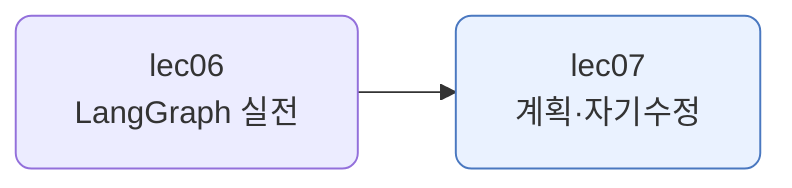
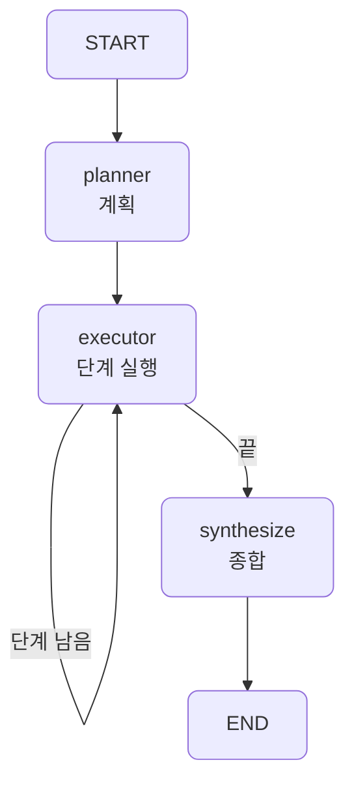
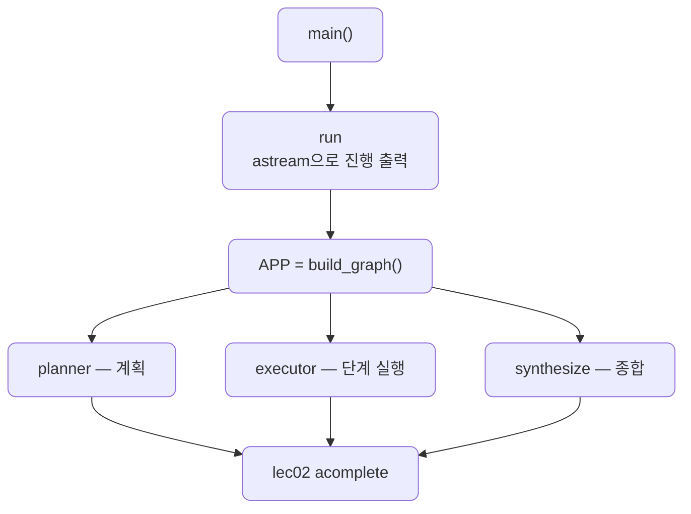
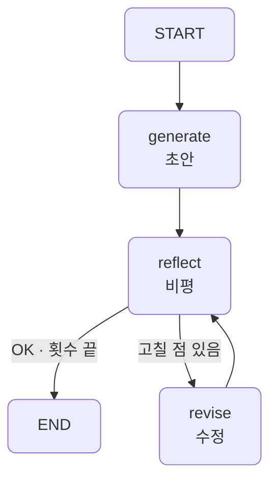
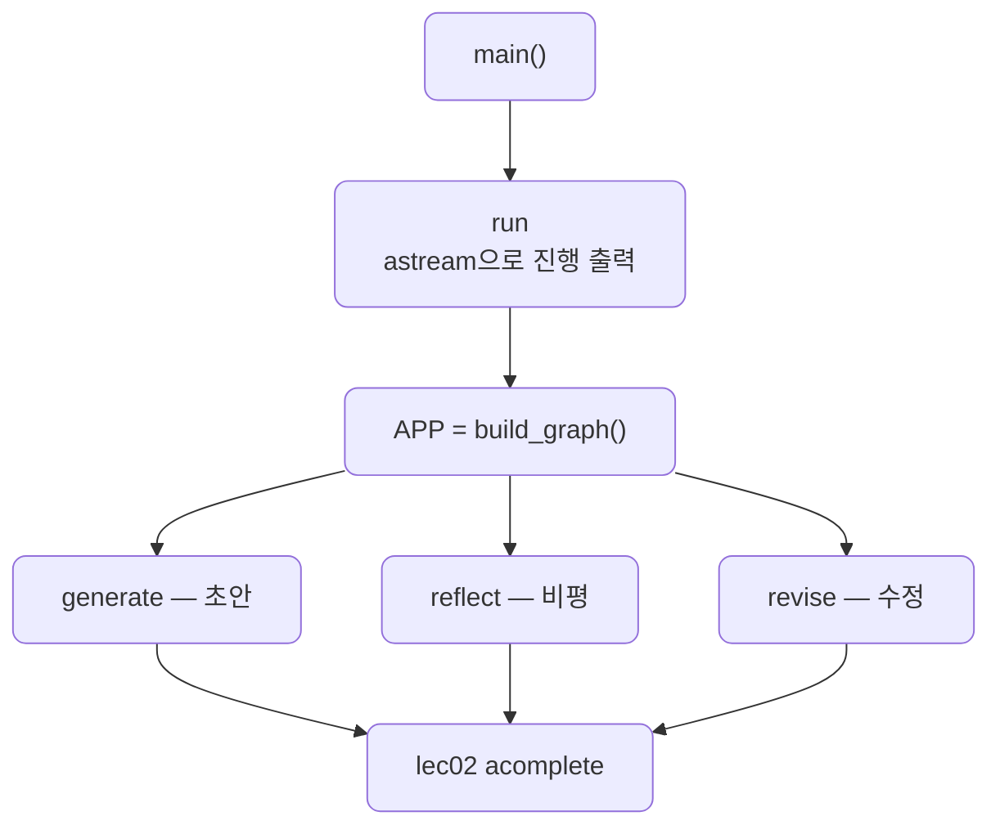

# lec07 — 계획 수립과 자기수정

> - S3 개요: [docs/section3/README.md](../README.md)
> - 분량 12분
> - 산출물: 계획·자기수정 에이전트

## 1. 목표

에이전트의 두 가지 아키텍처를 다룹니다. 먼저 전체 계획을 세우고 실행하는 계획 수립(plan-and-execute)과, 자기 출력을 비평하고 고치는 자기수정(reflection)입니다. 둘 다 LangGraph로 짭니다. lec05~06에서 익힌 상태·조건 엣지·루프를, 단일 에이전트가 아니라 이런 에이전트 아키텍처를 짜는 데 다시 씁니다.



## 2. 반응형, 그리고 또 다른 두 패턴

지금까지의 에이전트는 반응형이었습니다. 모델이 매 스텝 결과를 보고 다음 행동을 즉흥으로 정했습니다. lec02~03의 도구 루프가 그랬습니다. 이번에는 행동을 정하는 시점이 다른 두 패턴을 봅니다.

| 패턴 | 행동을 정하는 시점 | 핵심 |
| --- | --- | --- |
| 반응형 (lec02~03) | 매 스텝 즉흥 | 결과를 보고 다음 행동을 고름 |
| 계획 수립 | 처음에 전체 계획 | 선계획 후 그대로 실행 |
| 자기수정 | 만든 뒤 다시 봄 | 자기 출력을 비평하고 고침 |

두 패턴 모두 본질이 흐름입니다. 계획대로 단계를 도는 루프, 만족할 때까지 고치는 루프. 흐름이 핵심이라 plain 코드로도 짤 수 있지만, 루프와 분기가 또렷한 LangGraph가 잘 맞습니다. 흐름이 for·if에 숨는 대신 노드·엣지로 드러나고, 그래프가 스스로 그려집니다.

## 3. 계획 수립 — plan-and-execute

먼저 과제를 단계로 쪼개는 계획을 세우고(`planner`), 그 계획대로 단계를 하나씩 실행하며(`executor`), 단계가 다 끝나면 `synthesize`로 종합합니다. `executor`는 단계가 남는 동안 자기 자신으로 되돌아옵니다. lec06에서 본 카운터 루프입니다.

```python
def route(state):
    if state["step"] < len(state["plan"]):
        return "executor"      # 루프: 다음 단계로
    return "synthesize"        # 끝: 종합으로

graph.add_edge("planner", "executor")
graph.add_conditional_edges("executor", route, {"executor": "executor", "synthesize": "synthesize"})
```



코드는 노드 셋과 그것을 잇는 `build_graph`, 그래프를 돌리는 `run`으로 이뤄집니다. `planner`는 과제를 단계 목록으로 쪼개 상태의 `plan`에 넣고, `executor`는 `plan[step]`을 실행해 `results`에 더하며 `step`을 한 칸 밉니다. `synthesize`는 단계 결과들을 한 편의 글로 합칩니다. 셋 다 lec02의 `acomplete`로 모델을 부르고, `run`은 `astream`으로 노드가 도는 과정을 찍습니다.



단계는 앞 결과에 기대므로 순차로 돕니다. lec06의 도시들이 서로 독립이라 `Send`로 병렬이던 것과 대비됩니다. [plan_execute.py](../../../src/section3/lec07/plan_execute.py)를 실행한 결과입니다.

```text
과제: 초보자에게 RAG가 무엇인지 설명하는 짧은 글을 써줘.
  [planner] 4단계 계획 수립
  [executor] 1단계까지 실행
  [executor] 2단계까지 실행
  [executor] 3단계까지 실행
  [executor] 4단계까지 실행
  [synthesize] 종합

세운 계획:
  1. RAG는 AI가 더 정확하고 최신 정보로 답하도록 돕는 기술
  2. 일반 LLM은 학습된 데이터 안에서만 답해 최신·심층 정보에 약함
  3. 질문을 받으면 외부 정보원에서 관련 정보를 검색
  4. 검색한 정보를 참고해 LLM이 답을 생성

종합한 글:
RAG는 AI가 특정 질문에 더 정확하고 최신 정보로 답하도록 돕는 기술입니다. 일반적인 LLM은
학습된 데이터 안에서만 답해 최신이거나 심층적인 내용에 약합니다. RAG는 질문을 받으면 먼저
외부 정보원에서 관련 정보를 검색하고, 그 정보를 참고 자료처럼 활용해 답을 생성합니다.
```

모델이 먼저 네 단계 계획을 세우고, executor 루프가 단계마다 한 칸씩 돌며 채운 뒤, 종합합니다. 계획이 상태에 남아 있어 어디까지 왔는지가 또렷합니다.

## 4. 자기수정 — reflection

한 번에 잘 쓰기는 어렵습니다. 사람도 초안을 쓰고 다시 읽고 고칩니다. 자기수정은 그 과정을 그래프로 짭니다. `generate`로 초안을 만들고 `reflect`로 비평한 뒤, 충분히 좋거나 횟수가 차면 끝내고, 아니면 `revise`로 고쳐 다시 `reflect`로 돌아옵니다. 되돌아오는 엣지가 만드는 사이클입니다.

```python
def route(state):
    if _is_satisfied(state["critique"]) or state["rounds"] >= MAX_ROUNDS:
        return END
    return "revise"

graph.add_conditional_edges("reflect", route, {"revise": "revise", END: END})
graph.add_edge("revise", "reflect")   # 사이클
```



코드는 노드 셋과 `build_graph`, `run`으로 이뤄집니다. `generate`는 초안을, `reflect`는 비평을, `revise`는 고친 초안을 만듭니다. 셋 다 lec02의 `acomplete`로 모델을 부릅니다. `build_graph`가 `reflect` 뒤에 `route`로 갈래를 두어 사이클을 만들고, `run`은 `astream`으로 진행을 찍습니다.



[reflection.py](../../../src/section3/lec07/reflection.py)를 최대공약수 함수로 돌리면, 비평이 다음 수정에 반영되어 코드가 단단해집니다.

```text
과제: 파이썬으로 두 정수의 최대공약수를 구하는 함수를 작성해줘.
  [generate] 초안 갱신
  [reflect] 비평 → 고칠 점 있음
  [revise] 초안 갱신
  [reflect] 비평 → OK

최종:
def gcd(a: int, b: int) -> int:
    if not isinstance(a, int) or not isinstance(b, int):
        raise TypeError("정수만 받습니다")
    a, b = abs(a), abs(b)
    while b:
        a, b = b, a % b
    return a
```

`reflect`가 "고칠 점 있음"을 내면 `revise`로 갔다가 다시 `reflect`로 돌아오고, "OK"를 내면 멈춥니다. 초안에 없던 타입 검증·타입 힌트가 한 바퀴 돌며 더해졌습니다. `MAX_ROUNDS`가 끝없는 반복을 막습니다.

## 5. 정리

- 반응형 말고도 에이전트를 짜는 패턴이 있습니다. 계획 수립은 길을 먼저 그리고, 자기수정은 만든 뒤 다시 봅니다.
- 계획 수립은 planner → executor 루프 → synthesize입니다. 한 조건 엣지가 단계 루프와 종료를 가릅니다.
- 자기수정은 generate → reflect → revise의 사이클입니다. 만족하거나 횟수가 차면 멈춥니다.
- 두 패턴은 흐름이라 plain으로도 짤 수 있지만, lec05~06의 상태·조건 엣지·루프로 짜면 흐름이 그래프로 드러나고 스스로 그려집니다.
