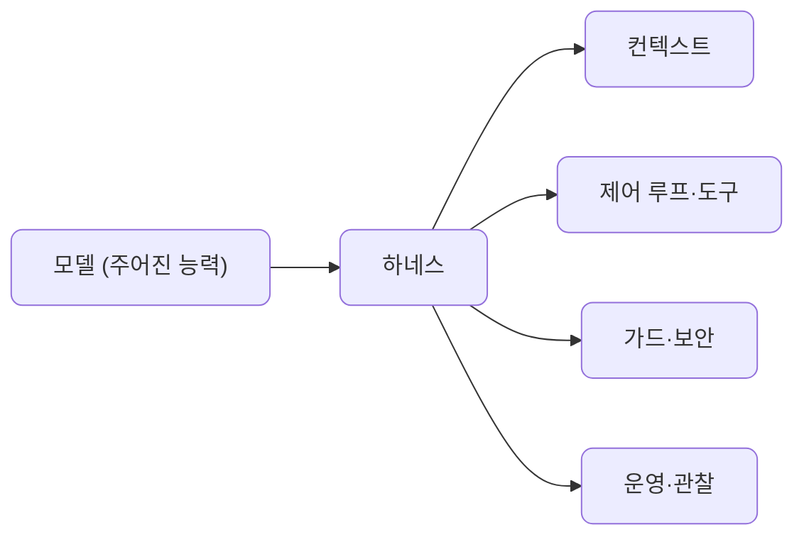
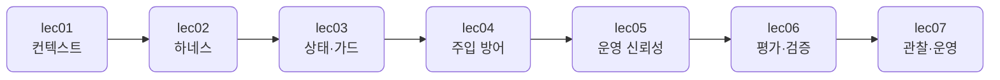

# S4 — 컨텍스트 & 하네스 엔지니어링: 신뢰성

> 상위 계획: [docs/plan/vod_plan.md](../plan/vod_plan.md)의 S4 항목

"동작하는 에이전트"를 "신뢰성 있게 출하 가능한 시스템"으로 끌어올리는 레이어입니다. 모델은 그대로 두고, 그 둘레의 하네스를 단단히 합니다. 윈도우에 무엇을 언제 넣을지(컨텍스트), 제어 루프와 도구 인터페이스를 어떻게 짤지(하네스), 상태와 행동을 어떻게 제약할지(가드레일), 주입을 어떻게 막을지(보안), 비용과 한계와 실패를 어떻게 견딜지(운영 신뢰성), 그리고 품질을 어떻게 재고 관찰할지(평가·관찰)를 다룹니다.

이 섹션을 마치면 같은 모델로도 더 안정적으로, 더 안전하게, 더 싸게 도는 에이전트 시스템이 손에 들어옵니다.

## 학습 방식

S1~S3과 같습니다. 예제 코드는 이 저장소로 공유되며, devcontainer 안에서 실행해 결과를 관찰하고 핵심을 읽어 이해합니다. 손으로 바꿔보는 부분은 각 단위의 "직접 해보기"로 한정합니다.

## 관통하는 원칙

에이전트는 모델 + 하네스입니다. 모델의 능력은 주어진 것으로 두고, 신뢰성은 하네스에서 만듭니다. 그래서 실패를 모델 탓으로 돌리지 않고 시스템 문제로 봅니다. 무엇이 깨지면 하네스의 어느 층(컨텍스트·루프·가드·운영)을 고쳐야 하는지로 생각합니다.

모든 LLM 호출은 앞 섹션처럼 LiteLLM을 경유합니다. 그래서 비용 추적·재시도·폴백 같은 운영 장치를 한 곳에서 두를 수 있습니다.

## 단위 구성

| 단위 | 분 | 주제 | 산출물 |
| --- | --- | --- | --- |
| [lec01](lec01/README.md) | 22 | 컨텍스트 엔지니어링 | 컨텍스트 조립 패턴 |
| [lec02](lec02/README.md) | 22 | 하네스 엔지니어링 | 최소 하네스 |
| [lec03](lec03/README.md) | 19 | 메모리·상태·가드레일 | 상태/가드 모듈 |
| [lec04](lec04/README.md) | 14 | 프롬프트 주입 방어 | 방어 체크리스트 |
| [lec05](lec05/README.md) | 20 | 운영 신뢰성: 비용·레이트리밋·회복력 | 운영 신뢰성 모듈 |
| [lec06](lec06/README.md) | 14 | 평가·검증 | 평가 하네스 |
| [lec07](lec07/README.md) | 12 | 관찰·운영 | 관찰 모듈 |

합계 123분, 7단위입니다.

## 흐름

신뢰성을 안에서 바깥으로 쌓습니다. 윈도우에 무엇을 넣을지(컨텍스트)와 루프·도구를 어떻게 짤지(하네스)로 토대를 놓고, 상태·가드레일과 주입 방어로 안전을 더합니다. 그다음 비용·한계·실패를 견디는 운영 신뢰성을 입히고, 마지막으로 품질을 재는 평가와 돌아가는 모습을 보는 관찰로 닫습니다.

## 코드와 테스트

공유되는 예제 코드는 [src/section4](../../src/section4)에, 테스트는 [tests/section4](../../tests/section4)에 같은 `lecNN` 구조로 들어 있습니다. 이 저장소를 받아 devcontainer 안에서 그대로 실행하는 것이 기본이고, 손으로 바꿔보는 부분은 각 단위의 "직접 해보기"로 한정합니다.
