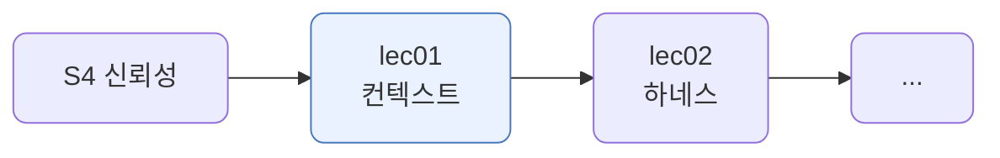
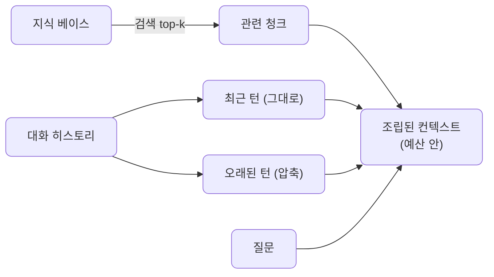
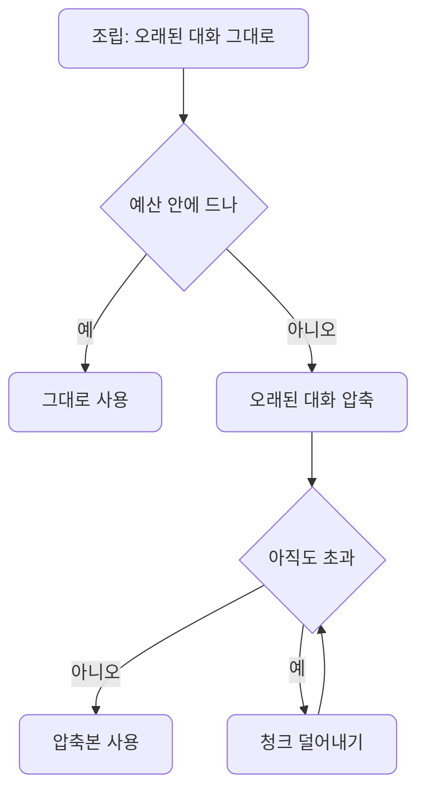
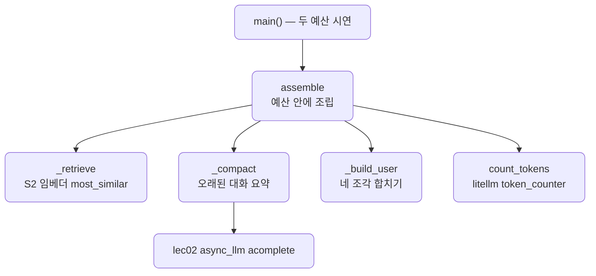

# lec01 — 컨텍스트 엔지니어링

> - S4 개요: [docs/section4/README.md](../README.md)
> - 분량 22분
> - 산출물: 컨텍스트 조립 패턴

## 1. 목표

한정된 컨텍스트 윈도우에 무엇을 언제 넣을지를 다룹니다. 검색·최근 대화·압축으로 필요한 것만 토큰 예산 안에 조립하는 패턴을 만듭니다. 같은 모델, 같은 질문도 무엇을 넣느냐로 답이 달라집니다.



## 2. 윈도우는 한정돼 있다

컨텍스트 윈도우는 토큰 수가 정해져 있습니다. 길게 넣을수록 비싸고 느리고, 한도를 넘으면 잘립니다. 그래서 가진 것을 다 넣을 수 없습니다. 무엇을 언제 넣을지 고르는 일이 컨텍스트 엔지니어링입니다.

사실 새로운 고민은 아닙니다. 램이 16MB이던 시절, 한정된 메모리에 무엇을 올릴지를 두고 온갖 최적화가 발전했습니다. 안 쓰는 것은 디스크로 내리고, 자주 쓰는 것만 올려 두고, 데이터를 압축해 담았습니다. 컨텍스트도 같은 느낌입니다. 공간이 빠듯하니 무엇을 올리고 무엇을 줄일지로 승부합니다.

세 가지 기법으로 자리를 아낍니다. 옛 메모리 최적화와 그대로 겹칩니다.

- 검색(retrieval): 지식 전체가 아니라 질문에 관련된 조각만 넣습니다. 필요한 것만 메모리에 올리는 셈입니다.
- 최근 우선(recency): 대화 전체가 아니라 가까운 몇 턴만 그대로 넣습니다. 자주 쓰는 것만 올려 두는 셈입니다.
- 압축(compaction): 오래된 대화는 요약으로 줄여 자리를 비웁니다. 데이터를 압축해 담는 셈입니다.

## 3. 네 가지 조각

조립하는 컨텍스트는 네 조각입니다. 지식 베이스에서 검색한 청크, 그대로 둘 최근 대화, 요약으로 줄인 오래된 대화, 그리고 질문입니다.



검색은 S2의 임베더를 그대로 씁니다. 질문과 청크를 임베딩해 가장 가까운 것을 `most_similar`로 고릅니다. 토큰은 `litellm.token_counter`로 잽니다. 압축은 LiteLLM으로 오래된 대화를 한두 문장으로 요약합니다.

## 4. 예산이 조립을 바꾼다

같은 질문, 같은 자료여도 예산이 달라지면 조립이 달라집니다. 먼저 오래된 대화를 그대로 넣어 보고, 예산에 들면 그대로 둡니다. 넘치면 오래된 대화를 압축하고, 그래도 넘치면 덜 관련된 청크부터 덜어냅니다.



넉넉하면 청크를 많이 넣고 오래된 대화도 그대로 둡니다. 빠듯하면 압축이 켜지고 청크가 줄어듭니다. 무엇을 버리고 무엇을 남길지가 예산에 따라 정해집니다.

## 5. 예제 코드가 하는 일 및 결과

[context_assembler.py](../../../src/section4/lec01/context_assembler.py)는 같은 질문을 두 예산으로 조립해 차이를 보입니다.



```bash
uv run python src/section4/lec01/context_assembler.py
```

```text
질문: 팀 기능을 쓰려면 나는 어떻게 해야 해?

=== 넉넉한 예산 (예산 400 토큰) ===
  조립: 294토큰 / 청크 4개 / 오래된 대화 verbatim
  --- 실제 전송 컨텍스트 ---
  [근거]
  - Pro 플랜은 월 2만 원이고 팀 협업 기능을 포함한다.
  - Pro 플랜 사용자는 우선 기술 지원을 받는다.
  - 데이터는 한국 리전 서버에 저장된다.
  - Free 플랜은 월 0원이며 개인 사용만 가능하다.
  [이전 대화]
  user: 안녕, 나는 지금 Free 플랜을 쓰고 있어.
  assistant: 네, Free 플랜을 사용 중이시군요. 무엇을 도와드릴까요?
  user: 회사 동료들이랑 같이 문서를 쓰고 싶어.
  assistant: 협업이 필요하시군요. 더 알려주시면 안내해 드릴게요.
  [최근 대화]
  user: 비용도 너무 비싸지 않았으면 해.
  assistant: 예산도 고려해서 보겠습니다.
  [질문] 팀 기능을 쓰려면 나는 어떻게 해야 해?
  --- 답 ---
  팀 협업 기능은 월 2만 원의 Pro 플랜에 포함되어 있습니다. 예산을 고려하여 Pro 플랜으로 전환하시면 됩니다.

=== 빠듯한 예산 (예산 160 토큰) ===
  조립: 148토큰 / 청크 1개 / 오래된 대화 compacted
  --- 실제 전송 컨텍스트 ---
  [근거]
  - Pro 플랜은 월 2만 원이고 팀 협업 기능을 포함한다.
  [이전 대화]
  사용자는 현재 Free 플랜을 사용 중이며, 회사 동료들과 문서 협업을 원합니다.
  [최근 대화]
  user: 비용도 너무 비싸지 않았으면 해.
  assistant: 예산도 고려해서 보겠습니다.
  [질문] 팀 기능을 쓰려면 나는 어떻게 해야 해?
  --- 답 ---
  팀 협업 기능은 월 2만 원인 Pro 플랜에 포함되어 있습니다.
```

읽어낼 점입니다.

- 실제 전송되는 컨텍스트를 보면 차이가 분명합니다. 넉넉한 예산은 청크 4개에 오래된 대화 4턴을 그대로 보내 294토큰, 빠듯한 예산은 청크 1개에 오래된 대화를 한 문장 요약으로 보내 148토큰입니다. 토큰 차이가 곧 무엇을 줄였는지입니다.
- 압축은 예산이 빠듯할 때 켜집니다. 오래된 대화 네 턴이 "Free 플랜, 협업 원함" 한 문장으로 줄어 자리를 비웁니다.
- 두 예산 다 답은 맞습니다. 청크가 하나로 줄어도 "Pro에 팀 기능"이 남고 요약에 "사용자는 Free"가 남아, 둘 다 Pro로 올리라고 답합니다. 무엇을 넣느냐가 답을 만듭니다.

## 6. 정리

- 윈도우는 한정돼 있어 가진 것을 다 넣을 수 없습니다. 무엇을 언제 넣을지 고르는 것이 컨텍스트 엔지니어링입니다.
- 검색으로 관련 자료만, 최근 우선으로 가까운 대화만, 압축으로 오래된 대화를 요약해 자리를 아낍니다.
- 토큰 예산이 조립을 좌우합니다. 빠듯하면 압축을 켜고 덜 관련된 것부터 덜어냅니다.
- 같은 질문도 무엇을 넣느냐로 답이 달라집니다. 컨텍스트는 모델에 주는 입력을 우리가 설계하는 일입니다.
