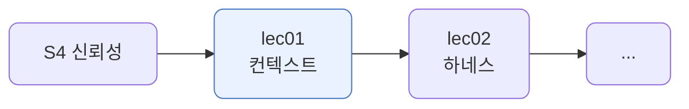
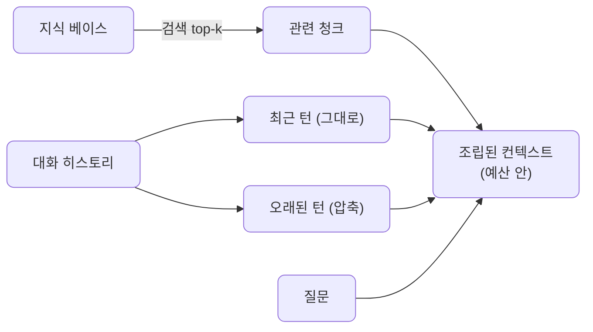
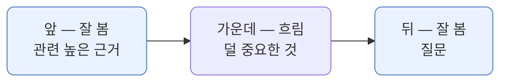
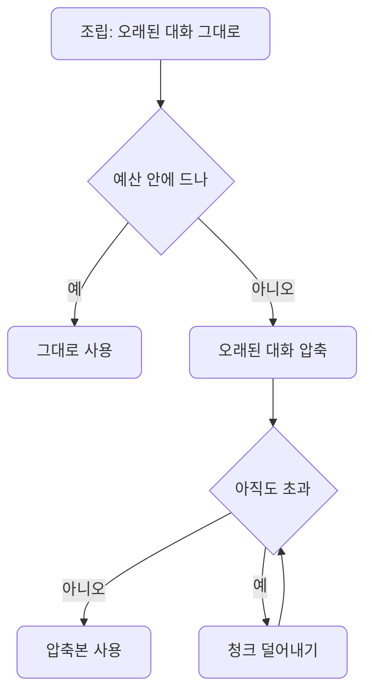
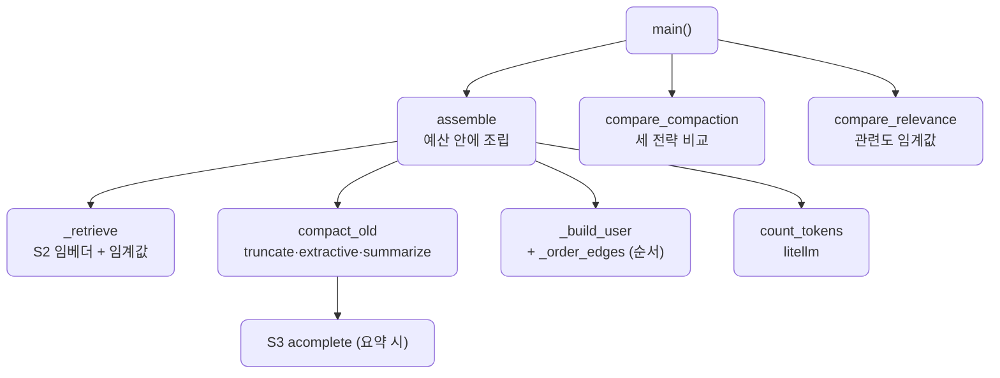

# lec01 — 컨텍스트 엔지니어링

> - S4 개요: [docs/section4/README.md](../README.md)
> - 분량 22분
> - 산출물: 컨텍스트 조립 패턴

## 1. 목표

한정된 컨텍스트 윈도우에 무엇을 어디에 어떻게 넣을지를 다룹니다. 검색·최근 대화·압축으로 필요한 것만 토큰 예산 안에 조립하는 패턴을 만듭니다. 같은 모델, 같은 질문도 무엇을 어떻게 넣느냐로 답이 달라집니다.



## 2. 윈도우는 한정돼 있다

컨텍스트 윈도우는 토큰 수가 정해져 있습니다. 길게 넣을수록 비싸고 느리고, 한도를 넘으면 잘립니다. 그래서 가진 것을 다 넣을 수 없습니다. 무엇을 언제 넣을지 고르는 일이 컨텍스트 엔지니어링입니다.

사실 새로운 고민은 아닙니다. 램이 16MB이던 시절, 한정된 메모리에 무엇을 올릴지를 두고 온갖 최적화가 발전했습니다. 안 쓰는 것은 디스크로 내리고, 자주 쓰는 것만 올려 두고, 데이터를 압축해 담았습니다. 컨텍스트도 같은 느낌입니다. 공간이 빠듯하니 무엇을 올리고 무엇을 줄일지로 승부합니다.

뒤에서 다룰 기법들이 옛 메모리 최적화와 그대로 겹칩니다. 검색은 필요한 것만 올리기, 최근 우선은 자주 쓰는 것만 두기, 압축은 줄여 담기, 순서는 빠른 자리에 중요한 것 두기에 해당합니다.

## 3. 무엇을 넣나 — 네 가지 조각

조립하는 컨텍스트는 네 조각입니다. 지식 베이스에서 검색한 청크, 그대로 둘 최근 대화, 요약으로 줄인 오래된 대화, 그리고 질문입니다.



검색은 S2의 임베더를 그대로 씁니다. 질문과 청크를 임베딩해 가장 가까운 것을 `most_similar`로 고릅니다. 토큰은 `litellm.token_counter`로 잽니다. 최근 대화는 가까운 두 턴을 그대로 두고, 오래된 대화는 줄여서 넣습니다.

## 4. 어디에 넣나 — 순서와 위치

무엇을 넣을지 골랐다면 어디에 둘지도 중요합니다. 모델은 긴 컨텍스트에서 가운데를 흘려보는 경향이 있습니다. 시작과 끝을 더 잘 봅니다. 이를 lost-in-the-middle라고 부릅니다. 그래서 중요한 것을 양 끝에 둡니다.



우리 구조는 이미 이 원리를 따릅니다. 근거를 앞쪽에, 질문을 맨 끝에 둡니다. 청크끼리도 `_order_edges`가 관련도 순으로 정렬해 가장 관련 높은 둘을 앞뒤 끝으로 보냅니다. 관련도 내림차순 `[A, B, C, D]`를 `[A, C, D, B]`로 바꿔, A와 B를 양 끝에 둡니다.

## 5. 어떻게 줄이나 — 압축의 갈래

오래된 대화를 줄이는 데도 갈래가 있습니다. 셋을 비교합니다.

| 전략 | 방식 | 비용 | 특징 |
| --- | --- | --- | --- |
| 잘라내기(truncate) | 최근 몇 턴만 남기고 버림 | 공짜·즉시 | 위치로 고름, 오래된 관련 정보를 잃을 수 있음 |
| 발췌(extractive) | 질문에 관련된 턴만 골라 그대로 | 임베딩, LLM 0회 | 관련도로 고름, 원문 유지 |
| 요약(summarize) | LLM이 한두 문장으로 압축 | LLM 1회 | 전체 맥락을 담음, 비용·지연 |

같은 오래된 대화 6턴을 세 전략으로 줄여 보면 차이가 분명합니다.

```text
=== 압축의 갈래 (오래된 대화 6턴) ===
  [  truncate]  41토큰 · LLM 0회 → user: 그 전에, 결제 영수증도 받을 수 있어? / assistant: 네, 설정에서 영수증을 받으실 수 있습니다.
  [extractive]  59토큰 · LLM 0회 → user: 회사 동료들이랑 같이 문서를 쓰고 싶어. / assistant: 협업이 필요하시군요. 더 알려주시면 안내해 드릴게요.
  [ summarize]  59토큰 · LLM 1회 → 사용자는 현재 Free 플랜을 사용하고 있으며, 회사 동료들과 문서 협업을 원하고, 결제 영수증을 받을 수 있는지 문의했습니다.
```

잘라내기는 최근 두 턴(영수증)을 남겨, 정작 질문에 중요한 협업 맥락을 놓칩니다. 발췌는 질문에 관련된 협업 턴을 그대로 살리되 LLM을 부르지 않습니다. 요약은 셋을 다 담지만 LLM 호출 비용이 듭니다. 위치냐 관련도냐 전체냐의 선택입니다.

## 6. 어떻게 담나 — 포맷과 구조

같은 내용도 구조가 있으면 모델이 더 잘 씁니다. 역할을 구분자로 나눠 경계를 또렷이 합니다.

- `[근거]`·`[이전 대화]`·`[최근 대화]`·`[질문]`처럼 조각마다 라벨을 붙입니다.
- 모델이 무엇이 근거이고 무엇이 질문인지 헷갈리지 않습니다. 특히 검색 청크나 도구 결과를 지시문과 한 덩어리로 섞지 않습니다.

이는 신뢰성과도 닿습니다. 외부에서 온 텍스트와 우리 지시를 구분자로 갈라 두면, 외부 텍스트가 지시를 가로채는 프롬프트 주입을 막기 쉬워집니다. 주입 방어는 lec04에서 다룹니다.

## 7. 예산이 조립을 바꾼다

같은 질문, 같은 자료여도 예산이 달라지면 조립이 달라집니다. 먼저 오래된 대화를 그대로 넣어 보고, 예산에 들면 그대로 둡니다. 넘치면 오래된 대화를 압축하고, 그래도 넘치면 덜 관련된 청크부터 덜어냅니다.



넉넉하면 청크를 많이 넣고 오래된 대화도 그대로 둡니다. 빠듯하면 압축이 켜지고 청크가 줄어듭니다. 무엇을 버리고 무엇을 남길지가 예산에 따라 정해집니다.

## 8. 더 넣는 게 늘 좋은 건 아니다

예산이 허용한다고 다 채우면 안 됩니다. 관련 없는 청크는 자리만 차지하는 게 아니라, 모델을 헷갈리게 해 답을 흐립니다. 신호에 잡음을 섞는 셈입니다. 그래서 예산과 별개로 관련도 임계값을 둬서, 일정 유사도 아래는 잡음으로 보고 넣지 않습니다.

```text
=== 더 넣는 게 늘 좋은 건 아니다 (관련도 임계값) ===
  질문: 팀 기능을 쓰려면 나는 어떻게 해야 해?
  유사도 (높을수록 관련):
    0.54  통과        Pro 플랜은 월 2만 원이고 팀 협업 기능을 포함한다.
    0.46  통과        Pro 플랜 사용자는 우선 기술 지원을 받는다.
    0.40  버림 (잡음)   데이터는 한국 리전 서버에 저장된다.
    0.39  버림 (잡음)   Free 플랜은 월 0원이며 개인 사용만 가능하다.
    0.39  버림 (잡음)   모바일 앱은 iOS와 Android 모두 지원한다.
    0.35  버림 (잡음)   환불은 결제 후 7일 이내에 가능하다.
  임계값 없음 → 청크 4개 (예산이 허용하는 만큼)
  임계값 0.45 → 청크 2개 (관련된 것만)
```

Pro 플랜 둘만 0.45를 넘고 나머지는 그 아래입니다. 예산은 청크 4개를 허용하지만, 임계값을 두면 관련된 2개만 들어갑니다. 데이터 리전이나 환불 안내는 팀 기능 질문과 무관해, 넣어 봐야 답에 도움이 안 되고 오히려 핵심을 묻습니다.

이는 4절의 lost-in-the-middle와 같은 결입니다. 거기서는 중요한 것을 양 끝에 두어 잡음에 묻히지 않게 했고, 여기서는 잡음을 아예 넣지 않아 신호를 지킵니다.

## 9. 예제 코드가 하는 일 및 결과

[context_assembler.py](../../../src/section4/lec01/context_assembler.py)는 같은 질문을 두 예산으로 조립해 실제 전송되는 컨텍스트와 그 답을 함께 보이고, 압축 전략과 관련도 임계값도 비교합니다.



```bash
uv run python src/section4/lec01/context_assembler.py
```

```text
=== 넉넉한 예산 (예산 400 토큰) ===
  조립: 335토큰 / 청크 4개 / 오래된 대화 verbatim
  --- 실제 전송 컨텍스트 ---
  [근거]
  - Pro 플랜은 월 2만 원이고 팀 협업 기능을 포함한다.
  - 데이터는 한국 리전 서버에 저장된다.
  - Free 플랜은 월 0원이며 개인 사용만 가능하다.
  - Pro 플랜 사용자는 우선 기술 지원을 받는다.
  [이전 대화]
  user: 안녕, 나는 지금 Free 플랜을 쓰고 있어.
  ... (오래된 대화 6턴 그대로) ...
  [최근 대화]
  user: 비용도 너무 비싸지 않았으면 해.
  assistant: 예산도 고려해서 보겠습니다.
  [질문] 팀 기능을 쓰려면 나는 어떻게 해야 해?
  --- 답 ---
  팀 기능을 사용하시려면 Pro 플랜으로 업그레이드하셔야 합니다. Pro 플랜은 월 2만 원입니다.

=== 빠듯한 예산 (예산 200 토큰) ===
  조립: 189토큰 / 청크 2개 / 오래된 대화 summarize
  --- 실제 전송 컨텍스트 ---
  [근거]
  - Pro 플랜은 월 2만 원이고 팀 협업 기능을 포함한다.
  - Pro 플랜 사용자는 우선 기술 지원을 받는다.
  [이전 대화]
  사용자는 현재 Free 플랜을 사용 중이며, 회사 동료들과의 문서 협업과 결제 영수증 수령에 대해 문의했습니다.
  [최근 대화]
  user: 비용도 너무 비싸지 않았으면 해.
  assistant: 예산도 고려해서 보겠습니다.
  [질문] 팀 기능을 쓰려면 나는 어떻게 해야 해?
  --- 답 ---
  팀 협업 기능은 Pro 플랜에 포함되어 있습니다.
```

읽어낼 점입니다.

- 실제 전송되는 컨텍스트를 보면 차이가 분명합니다. 넉넉한 예산은 청크 4개에 오래된 대화 6턴을 그대로 보내 335토큰, 빠듯한 예산은 청크 2개에 오래된 대화를 한 문장 요약으로 보내 189토큰입니다. 토큰 차이가 곧 무엇을 줄였는지입니다.
- 압축은 예산이 빠듯할 때 켜집니다. 오래된 대화 여섯 턴이 한 문장으로 줄어 자리를 비우고, 그 자리에 근거 청크가 남습니다.
- 두 예산 다 답은 맞습니다. 청크가 줄어도 "Pro에 팀 기능"이 남고 요약에 "사용자는 Free"가 남아, 둘 다 Pro를 가리킵니다. 무엇을 넣느냐가 답을 만듭니다.

## 10. 정리

- 윈도우는 한정돼 있어 가진 것을 다 넣을 수 없습니다. 옛 16MB 램 시절 메모리 최적화처럼, 무엇을 어디에 어떻게 넣을지 고르는 일이 컨텍스트 엔지니어링입니다.
- 무엇을: 검색으로 관련 자료만, 최근 우선으로 가까운 대화만, 압축으로 오래된 대화를 줄여 자리를 아낍니다.
- 어디에: 모델은 양 끝을 더 잘 보므로 중요한 것을 앞뒤 끝에 둡니다.
- 어떻게 줄이나: 잘라내기·발췌·요약 중 비용과 충실도를 보고 고릅니다.
- 어떻게 담나: 구분자로 역할을 갈라 모델이 파싱하기 쉽게, 외부 텍스트와 지시를 섞지 않게 합니다.
- 무엇을 빼나: 관련도 임계값으로 잡음을 거릅니다. 예산이 남아도 관련 낮은 청크는 답을 흐리니 넣지 않습니다.
- 토큰 예산이 이 모두를 좌우합니다. 같은 질문도 무엇을 넣느냐로 답이 달라집니다.
