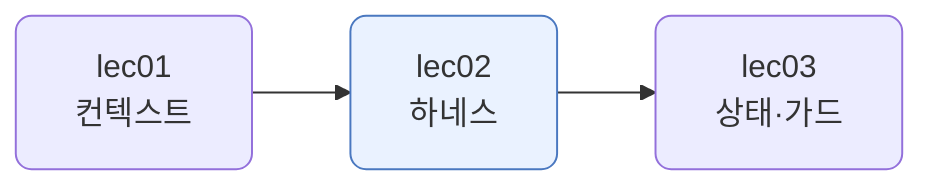
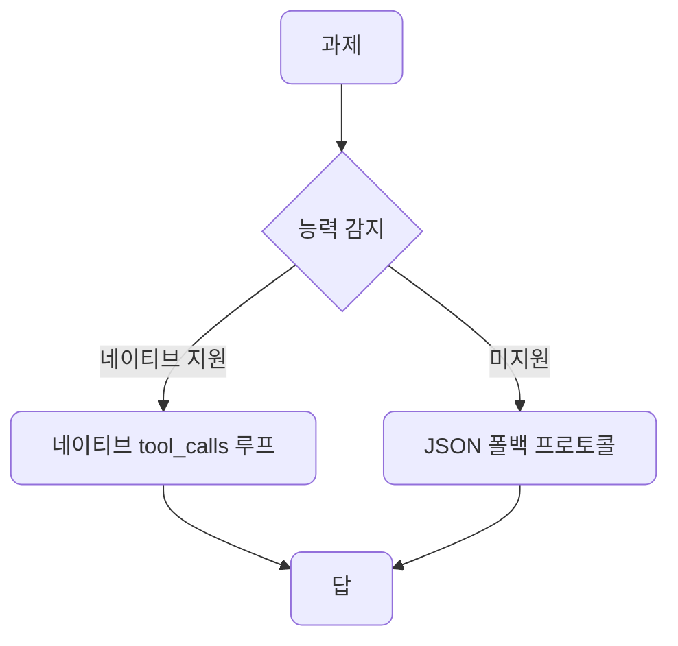
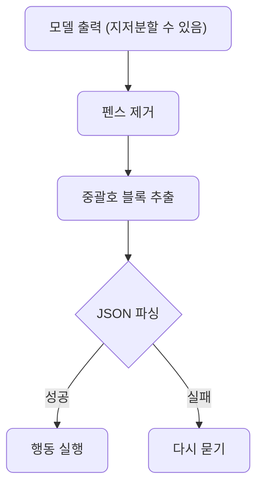
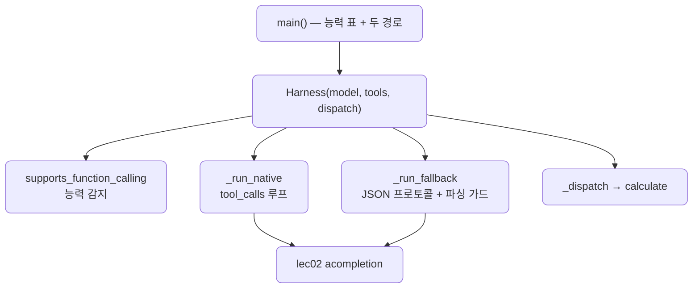

# lec02 — 하네스 엔지니어링

> - S4 개요: [docs/section4/README.md](../README.md)
> - 분량 22분
> - 산출물: 최소 하네스

## 1. 목표

에이전트는 모델 + 하네스입니다. 제어 루프와 도구 인터페이스를 설계하고, 모델 능력을 감지해 우아하게 강등하는 최소 하네스를 만듭니다. 같은 하네스가 강한 모델에서는 네이티브로, 약한 모델에서는 폴백으로 같은 과제를 끝냅니다.



## 2. 에이전트 = 모델 + 하네스

모델은 토큰을 내는 엔진일 뿐입니다. 도구를 부르고, 결과를 받아 다시 묻고, 깨진 출력을 추스르고, 약한 모델을 다독여 일을 시키는 것은 모두 그 둘레의 하네스가 합니다. 모델 능력은 주어진 것으로 두고, 신뢰성은 하네스에서 만듭니다.

그래서 무언가 어긋났을 때 모델 탓으로 돌리지 않습니다. 모델이 JSON을 지저분하게 내면 그것을 추스르지 못한 하네스의 문제입니다. 모델이 도구를 못 부르면 폴백을 안 둔 하네스의 문제입니다. 실패는 시스템 문제입니다.

| 하네스가 하는 일 | 이 단원에서 |
| --- | --- |
| 제어 루프 | 과제 → 모델 → 도구 → 결과 → 반복 |
| 도구 인터페이스 | 스키마로 모델에 도구를 설명 |
| 능력 감지 | 이 모델이 네이티브 도구 호출을 하나 |
| 우아한 강등 | 못 하면 JSON 폴백으로 같은 일 |
| 실패 복구 | 깨진 출력을 파싱 가드로 건짐 |

## 3. 제어 루프와 도구 인터페이스

제어 루프는 S3에서 본 그대로입니다. 과제를 모델에 주고, 모델이 도구를 부르면 실행해 결과를 돌려주고, 답이 나올 때까지 반복합니다. lec02는 이 루프를 `Harness` 한 덩어리로 묶어 모델·도구만 갈아 끼우게 합니다.

도구 인터페이스는 모델과 도구 사이의 계약입니다. 스키마를 잘 써야 모델이 제대로 부릅니다. 재사용하는 `calculate` 스키마를 보면, 이름과 설명으로 언제 쓸지 알리고, `op`를 enum으로 묶어 모델이 아무 문자열이나 넣지 못하게 하고, 타입과 required로 인자를 못박습니다.

```python
SCHEMA = {
    "type": "function",
    "function": {
        "name": "calculate",
        "description": "두 수를 사칙연산한다. 정확한 산술이 필요할 때 쓴다.",
        "parameters": {
            "type": "object",
            "properties": {
                "a": {"type": "number", "description": "첫 번째 수"},
                "b": {"type": "number", "description": "두 번째 수"},
                "op": {"type": "string", "enum": ["add", "subtract", "multiply", "divide"]},
            },
            "required": ["a", "b", "op"],
        },
    },
}
```

좋은 스키마는 모델이 틀릴 여지를 줄입니다. enum이 없으면 모델은 `"곱하기"`나 `"x"`를 넣을 수 있고, 그러면 하네스가 또 추슬러야 합니다. 인터페이스 설계가 실패 복구 부담을 미리 던다는 뜻입니다.

## 4. 능력 감지

모델마다 네이티브 도구 호출을 지원하는지가 다릅니다. LiteLLM이 이를 알려줍니다.

```python
litellm.supports_function_calling("gemini/gemini-2.5-flash")  # True
litellm.supports_function_calling("ollama/llama3.2")          # False
```

하네스는 이 한 줄로 경로를 가릅니다. 지원하면 네이티브 도구 호출을, 아니면 폴백 프로토콜을 씁니다. 호출 한 번 없이 메타데이터만으로 판단하니 공짜입니다.

## 5. 우아한 강등 — 네이티브와 폴백

같은 과제를 두 경로로 처리합니다. 네이티브는 모델의 `tool_calls`를 그대로 받고, 폴백은 도구를 프롬프트로 설명해 모델이 JSON으로 행동을 내게 합니다.



폴백 프로토콜은 도구 스키마를 사람이 읽는 설명으로 바꿔 시스템 프롬프트에 넣고, `{"tool": "이름", "args": {...}}` 또는 `{"answer": "..."}` JSON만 내라고 시킵니다. 모델이 JSON을 내면 그걸 파싱해 도구를 실행하고, 결과를 다시 넣어 반복합니다. 네이티브 도구 호출이 없는 모델도 이 약속으로 같은 일을 합니다.

## 6. 실패는 시스템 문제 — 파싱 가드

약한 모델은 JSON만 내라고 해도 앞뒤에 말을 붙이거나 마크다운 펜스로 감쌉니다. 하네스는 이를 모델 탓으로 두지 않고 건져냅니다. 펜스를 걷고, 중괄호 블록을 뽑아, 파싱합니다. 그래도 안 되면 다시 묻습니다.



```python
@staticmethod
def _parse_action(raw: str) -> dict | None:
    text = raw.strip()
    fence = re.search(r"```(?:json)?\s*(.*?)```", text, re.DOTALL)
    if fence:
        text = fence.group(1).strip()
    block = re.search(r"\{.*\}", text, re.DOTALL)
    if not block:
        return None
    try:
        return json.loads(block.group(0))
    except json.JSONDecodeError:
        return None
```

`네, 계산하겠습니다. {"tool": "calculate", ...} 입니다.` 같은 출력에서도 행동을 건져냅니다. 모델이 약속을 어겨도 하네스가 메꾼다는 것, 이것이 "실패는 시스템 문제"의 실천입니다.

## 7. 예제 코드가 하는 일 및 결과

[harness.py](../../../src/section4/lec02/harness.py)는 능력 감지 표를 찍고, 같은 과제를 네이티브와 강등(JSON) 두 경로로 돌려 같은 답에 닿는지 보입니다.



```bash
uv run python src/section4/lec02/harness.py
```

```text
=== 능력 감지 ===
  gemini/gemini-2.5-flash        → 네이티브 도구 호출
  openai/gpt-4o                  → 네이티브 도구 호출
  ollama/llama3.2                → JSON 폴백
  ollama/gemma2:2b               → JSON 폴백

과제: 3 곱하기 4를 계산하고, 그 결과에 10을 더하면 얼마야?
  감지된 경로: 네이티브
  [네이티브]  3 곱하기 4는 12이고, 그 결과에 10을 더하면 22입니다.
  [강등 JSON] 3 곱하기 4는 12이고, 12에 10을 더하면 22입니다.
```

읽어낼 점입니다.

- 능력 감지가 모델마다 갈립니다. gemini와 gpt-4o는 네이티브, ollama 계열은 폴백입니다. 하네스는 이 한 줄을 보고 경로를 정합니다.
- 같은 과제가 두 경로 모두 22에 닿습니다. 네이티브는 모델의 도구 호출을, 강등은 JSON 프로토콜을 쓰지만, 같은 도구를 같은 루프로 돌립니다. 모델이 바뀌어도 하네스가 메꿉니다.
- 과제는 곱셈과 덧셈 두 번의 도구 호출을 거칩니다. 제어 루프가 결과를 다시 넣어 다음 호출을 끌어냅니다.

## 8. 정리

- 에이전트는 모델 + 하네스입니다. 모델 능력은 주어진 것으로 두고, 신뢰성은 하네스에서 만듭니다.
- 도구 인터페이스를 잘 설계하면(enum·타입·설명) 모델이 틀릴 여지가 줄어, 실패 복구 부담을 미리 덜어 줍니다.
- 능력 감지로 모델이 네이티브 도구 호출을 하는지 보고, 못 하면 JSON 폴백으로 우아하게 강등합니다.
- 모델이 약속을 어겨도 파싱 가드로 건져내고 다시 묻습니다. 실패는 모델 탓이 아니라 시스템 문제입니다.
