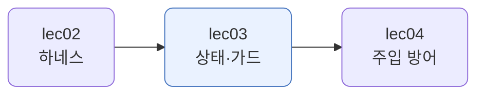
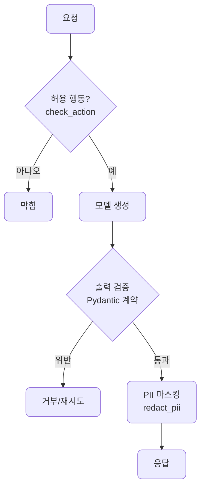
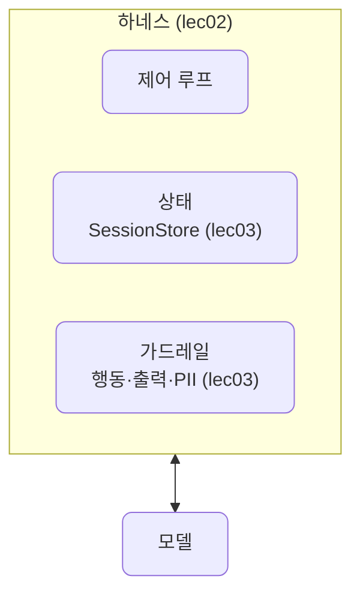
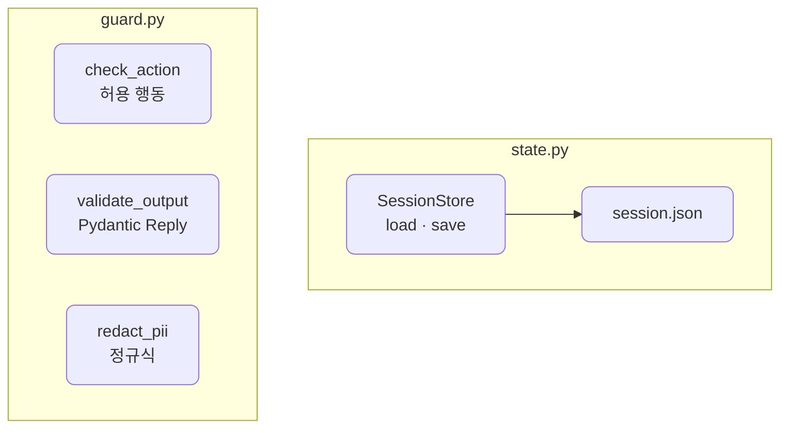

# lec03 — 메모리·상태·가드레일

> - S4 개요: [docs/section4/README.md](../README.md)
> - 분량 19분
> - 산출물: 상태/가드 모듈

## 1. 목표

lec02 하네스에서 자리만 잡아 둔 상태와 가드레일을 본격적으로 채웁니다. 세션이 끊겨도 사용자를 기억하는 상태 저장과, 허용 행동·출력·개인정보를 검사하는 가드레일을 만듭니다.



## 2. 윈도우 밖의 기억

lec01의 컨텍스트 윈도우는 한 번의 호출 안에서만 삽니다. 호출이 끝나면 사라집니다. 그런데 서비스는 사용자가 어제 한 말을 오늘도 기억해야 합니다. 그래서 기억할 것은 윈도우 밖, 디스크에 둡니다.

윈도우가 작업 기억이라면, 세션 상태는 장기 기억입니다. 매 호출 윈도우에 통째로 넣는 대신, 디스크에 두고 필요한 것만 꺼내 lec01의 어셈블러로 조립해 넣습니다.


## 3. 세션 상태 지속

[state.py](../../../src/section4/lec03/state.py)의 `SessionStore`는 세션 상태를 `session_id`별 JSON 파일로 저장합니다. 프로세스가 죽어도 다음 세션이 같은 id로 불러오면 사실이 그대로 살아 있습니다.

```python
@dataclass
class SessionState:
    session_id: str
    facts: dict = field(default_factory=dict)
    turns: int = 0

class SessionStore:
    def load(self, session_id) -> SessionState: ...  # 없으면 빈 상태
    def save(self, state) -> None: ...               # 디스크에 JSON
```

```text
세션 1 저장: facts={'name': 'Alice', 'plan': 'Free'}, turns=1
재시작 후 불러옴: facts={'name': 'Alice', 'plan': 'Free'}, turns=1
기억된 플랜: Free
다른 세션(bob): facts={} (빈 상태로 시작)
```

새 `SessionStore` 인스턴스는 프로세스를 다시 띄운 것과 같습니다. 그래도 디스크에서 Alice의 플랜을 그대로 불러옵니다. 세션 id가 다르면(bob) 빈 상태로 시작합니다. 상태가 사용자별로 따로 산다는 뜻입니다.

## 4. 가드레일 세 겹

상태가 기억이라면, 가드레일은 안전장치입니다. 요청이 들어와 응답이 나가기까지 세 곳에서 검사합니다. 허용된 행동인지, 출력이 계약을 지키는지, 개인정보가 새지 않는지입니다.



### 4.1. 허용 행동 제약

에이전트가 할 수 있는 행동을 목록으로 못박습니다. 목록 밖은 막습니다. lec02 harness2의 도구 허용 목록과 같은 결인데, 여기서는 행동 단위의 정책으로 둡니다.

```python
ALLOWED_ACTIONS = {"lookup", "summarize", "recommend"}

def check_action(action):
    if action not in ALLOWED_ACTIONS:
        raise GuardError(f"허용되지 않은 행동: {action}")
```

`lookup`은 통과하고 `delete_account`는 막힙니다. 모델이 위험한 행동을 하자고 해도 가드가 거른다는 뜻입니다.

### 4.2. 출력 검증 — Pydantic 계약

모델 출력이 우리가 정한 계약을 지키는지 봅니다. 계약은 Pydantic 스키마로 적습니다. 이는 S1의 구조화 출력과 같은 결이고, lec02에서 본 하네스의 검증 층을 본격적으로 채우는 일입니다. 모델을 믿지 않고 스키마로 받아 검사합니다.

```python
class Reply(BaseModel):
    answer: str
    confidence: float = Field(ge=0, le=1)

def validate_output(data):
    try:
        return Reply(**data)
    except ValidationError as exc:
        raise GuardError(f"출력 검증 실패: {exc.error_count()}건") from exc
```

`confidence`가 1.5이면 범위를 벗어나 막히고, `answer`가 없으면 필드 누락으로 막힙니다. 계약을 어긴 출력은 사용자에게 닿기 전에 걸러집니다.

### 4.3. PII 마스킹

이메일·전화·주민번호 같은 개인정보를 내보내기 전에 가립니다. 검색 결과나 모델 출력에 개인정보가 섞여 나가는 것을 막습니다.

```python
PII_RULES = [
    (re.compile(r"[\w.+-]+@[\w-]+\.[\w.-]+"), "[이메일]"),
    (re.compile(r"01[016789]-?\d{3,4}-?\d{4}"), "[전화]"),
    (re.compile(r"\d{6}-\d{7}"), "[주민번호]"),
]
```

`고객 이메일은 alice@example.com, 전화는 010-1234-5678입니다.`가 `고객 이메일은 [이메일], 전화는 [전화]입니다.`로 나갑니다.

## 5. 상태와 가드를 하네스에 끼우기

상태와 가드레일은 따로 노는 유틸리티가 아니라, lec02 하네스의 빈 슬롯을 채우는 부품입니다. 제어 루프 둘레에 상태 층과 가드레일 층으로 들어갑니다.



한 번의 처리 흐름은 이렇습니다. 세션 상태를 `load`로 불러와 컨텍스트에 보태고, 허용 행동인지 보고, 모델을 돌리고, 출력을 검증·마스킹해 내보낸 뒤, 바뀐 상태를 `save`로 저장합니다. lec02에서 "가드레일은 자리만 잡고 lec03에서 채운다"고 한 그 자리입니다.

## 6. 예제 코드가 하는 일 및 결과

[state.py](../../../src/section4/lec03/state.py)는 세션 상태의 저장·불러오기를, [guard.py](../../../src/section4/lec03/guard.py)는 세 가드레일을 각각 보입니다.



```bash
uv run python src/section4/lec03/state.py
uv run python src/section4/lec03/guard.py
```

```text
=== 허용 행동 제약 ===
  lookup: 허용
  delete_account: 막힘 (허용되지 않은 행동: delete_account)

=== PII 마스킹 ===
  원문:   고객 이메일은 alice@example.com, 전화는 010-1234-5678입니다.
  마스킹: 고객 이메일은 [이메일], 전화는 [전화]입니다.

=== 출력 검증 (Pydantic 계약) ===
  {'answer': 'Pro 플랜을 추천합니다', 'confidence': 0.9} → 통과: Pro 플랜을 추천합니다 (0.9)
  {'answer': '확실합니다', 'confidence': 1.5} → 출력 검증 실패: 1건
  {'answer': '필드 누락'} → 출력 검증 실패: 1건
```

읽어낼 점입니다.

- 상태는 윈도우 밖에서 삽니다. 프로세스를 다시 띄워도(새 store 인스턴스) Alice의 플랜을 기억합니다. 세션 id로 사용자를 갈라 각자 따로 기억합니다.
- 가드레일은 세 곳에서 막습니다. 허용 목록 밖 행동, 계약을 어긴 출력, 개인정보가 각각 다른 가드에 걸립니다.
- 출력 검증은 모델을 믿지 않습니다. confidence가 1.5처럼 말이 안 되면 사용자에게 닿기 전에 막습니다. 스키마가 계약이고, 가드가 그 계약을 집행합니다.

## 7. 정리

- 윈도우는 한 호출에서만 삽니다. 세션을 넘는 기억은 디스크에 둔 상태로 잇습니다.
- 가드레일은 허용 행동·출력 계약·개인정보를 세 곳에서 검사합니다.
- 출력 검증은 Pydantic 계약으로 합니다. S1 구조화 출력과 같은 결이고, 하네스의 검증 층을 채웁니다.
- 상태와 가드는 lec02 하네스의 빈 슬롯에 끼우는 부품입니다. 모델 둘레에 기억과 안전장치를 두릅니다.
