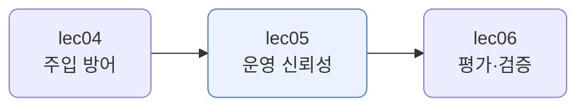
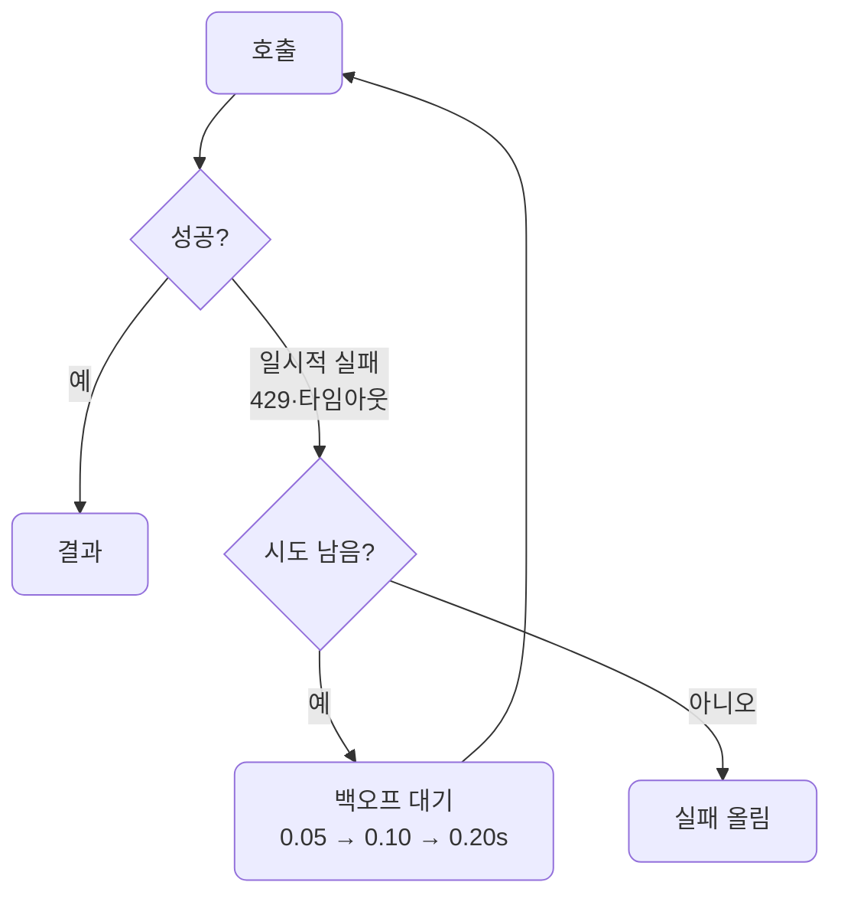
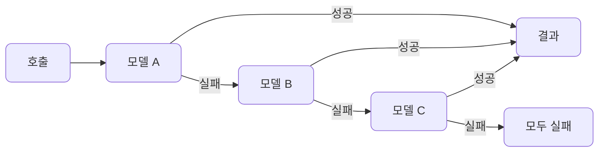
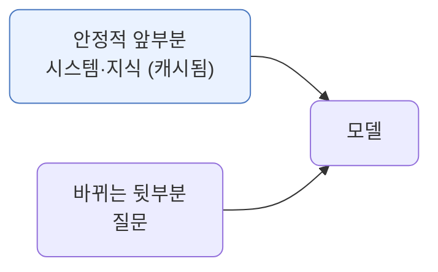
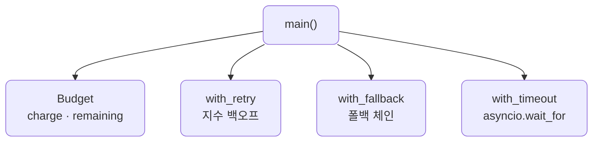

# lec05 — 운영 신뢰성: 비용·레이트리밋·회복력

> - S4 개요: [docs/section4/README.md](../README.md)
> - 분량 20분
> - 산출물: 운영 신뢰성 모듈

## 1. 목표

"동작하는" 에이전트를 "출하 가능한" 시스템으로 끌어올리는 운영 층을 만듭니다. 토큰·비용 예산, 재시도·백오프·타임아웃, 폴백 체인, 프롬프트 캐싱으로 비용과 한계와 실패를 견디게 합니다.



## 2. 운영 신뢰성이란

데모에서 한 번 도는 것과, 수천 명이 동시에 쓰는 서비스로 사는 것은 다릅니다. 모델 호출은 돈이 들고, 레이트리밋에 걸리고, 가끔 실패하고, 느려집니다. 운영 신뢰성은 이 현실을 견디는 층입니다. 모델 호출 둘레에 두릅니다.

- 비용: 토큰을 누적해 예산을 넘으면 막습니다. 폭주를 막는 안전판입니다.
- 한계: 레이트리밋(429)에 걸리면 잠깐 쉬었다 다시 시도합니다.
- 실패: 한 모델이 안 되면 다른 모델로 넘어갑니다.
- 지연: 너무 느리면 끊습니다.

여기서는 패턴을 손으로 짜 봅니다. 실전에서는 이 호출이 LiteLLM이고, LiteLLM이 `num_retries`·`fallbacks`·`timeout`을 내장 지원합니다. 직접 짜 보면 그 내장 기능이 무엇을 하는지 또렷해집니다.

## 3. 비용·토큰 예산

토큰은 곧 돈입니다. 에이전트가 루프를 돌며 호출을 거듭하면 비용이 새기 쉽습니다. 그래서 예산을 두고, 쓴 만큼 누적해 한도를 넘으면 막습니다.

```python
class Budget:
    def charge(self, tokens):
        if self.spent + tokens > self.limit:
            raise BudgetError(...)
        self.spent += tokens
```

한도 1000에서 400씩 쓰면 두 번은 통과하고 세 번째(800+400)는 막힙니다. 폭주하는 에이전트가 돈을 무한정 태우지 못하게 하는 안전판입니다.

## 4. 재시도·백오프·타임아웃

레이트리밋(429)이나 일시적 오류는 잠깐 뒤 다시 하면 대개 됩니다. 그런데 바로 다시 때리면 서버를 더 밀어붙입니다. 그래서 쉬는 간격을 지수로 늘립니다. 이것이 백오프입니다. 그리고 무한정 기다리지 않게 타임아웃으로 끊습니다.



```python
async def with_retry(call, max_attempts=4, base_delay=0.05):
    for attempt in range(max_attempts):
        try:
            return await call()
        except (RateLimitError, TimeoutError):
            if attempt == max_attempts - 1:
                raise
            await asyncio.sleep(base_delay * (2 ** attempt))
```

대기 간격이 0.05, 0.10, 0.20초로 두 배씩 늡니다. 영구적 오류(스키마 오류 같은)는 재시도해도 소용없으니, 재시도는 일시적 오류에만 겁니다.

## 5. 폴백 체인

한 모델이나 프로바이더가 죽어도 서비스는 살아 있어야 합니다. 그래서 후보를 줄로 세워, 앞이 실패하면 다음으로 넘어갑니다.



재시도가 같은 모델을 다시 부르는 것이라면, 폴백은 아예 다른 모델로 바꾸는 것입니다. 둘을 겹쳐 쓰기도 합니다. 한 모델에 몇 번 재시도하고, 그래도 안 되면 다음 모델로 폴백합니다.

## 6. 프롬프트 캐싱

같은 시스템 프롬프트나 큰 지식을 매 호출 새로 보내면, 그 토큰값을 매번 냅니다. 프로바이더는 안정적인 앞부분을 캐시해 두고, 다음 호출에서 그 부분을 싸게(캐시된 토큰은 훨씬 저렴) 재사용합니다. 비용과 지연이 같이 줄어듭니다.



핵심은 순서입니다. 안정적인 것(시스템·지식)을 앞에, 매번 바뀌는 것(질문)을 뒤에 둬야 앞부분이 캐시로 재사용됩니다. lec01에서 순서를 모델 주목도 때문에 다뤘다면, 여기서는 캐시 때문에 다시 중요해집니다. Anthropic·OpenAI·Gemini가 지원하고 LiteLLM으로 켭니다.

## 7. 예제 코드가 하는 일 및 결과

[reliability.py](../../../src/section4/lec05/reliability.py)는 네 패턴을 가짜 호출로 결정적으로 보입니다. 레이트리밋을 일부러 일으킬 수 없으니, 모사한 실패로 메커니즘을 드러냅니다.



```bash
uv run python src/section4/lec05/reliability.py
```

```text
=== 비용·토큰 예산 (한도 1000) ===
  +400 토큰 → 남은 예산 600
  +400 토큰 → 남은 예산 200
  +400 토큰 → 예산 초과: 800 + 400 > 1000

=== 재시도·백오프 (429 두 번 뒤 성공) ===
  1번째 실패(429 Too Many Requests) → 0.05s 대기 후 재시도
  2번째 실패(429 Too Many Requests) → 0.10s 대기 후 재시도
  결과: 성공 (총 3회 시도)

=== 폴백 체인 (앞 모델 실패 → 다음) ===
  후보 0 실패(모델 A 과부하) → 다음으로
  결과: 모델 B 응답

=== 타임아웃 (0.1s 한도) ===
  0.1s 초과 → TimeoutError로 끊음
```

읽어낼 점입니다.

- 예산은 누적 한도입니다. 800을 쓴 뒤 400을 더 쓰려 하면 막힙니다. 비용이 새기 전에 멈춥니다.
- 재시도는 백오프와 함께 갑니다. 대기가 0.05, 0.10초로 두 배씩 늘어, 서버를 몰아붙이지 않으면서 일시적 실패를 넘깁니다. 두 번 실패해도 세 번째에 성공합니다.
- 폴백은 다른 후보로 넘어갑니다. 모델 A가 과부하여도 모델 B가 받아 서비스가 죽지 않습니다.
- 타임아웃은 무한정 기다리지 않게 끊습니다. 느린 호출 하나가 전체를 잡아먹지 않게 합니다.

## 8. 정리

- 운영 신뢰성은 비용·한계·실패·지연을 견디는 층입니다. 모델 호출 둘레에 두릅니다.
- 비용은 토큰 예산으로 막고, 일시적 실패는 지수 백오프 재시도로 넘기고, 모델이 죽으면 폴백 체인으로 잇고, 느리면 타임아웃으로 끊습니다.
- 프롬프트 캐싱은 안정적인 앞부분을 재사용해 비용·지연을 줄입니다. 안정적인 것을 앞에 두는 순서가 관건입니다.
- 손으로 짜 본 이 패턴들을 실전에서는 LiteLLM이 `num_retries`·`fallbacks`·`timeout`으로 내장 지원합니다.
