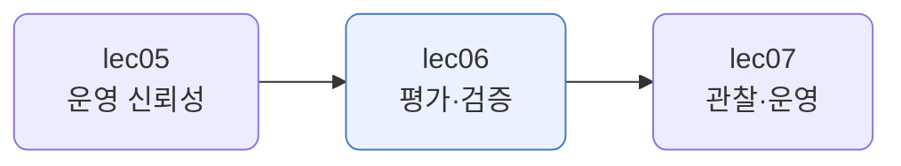
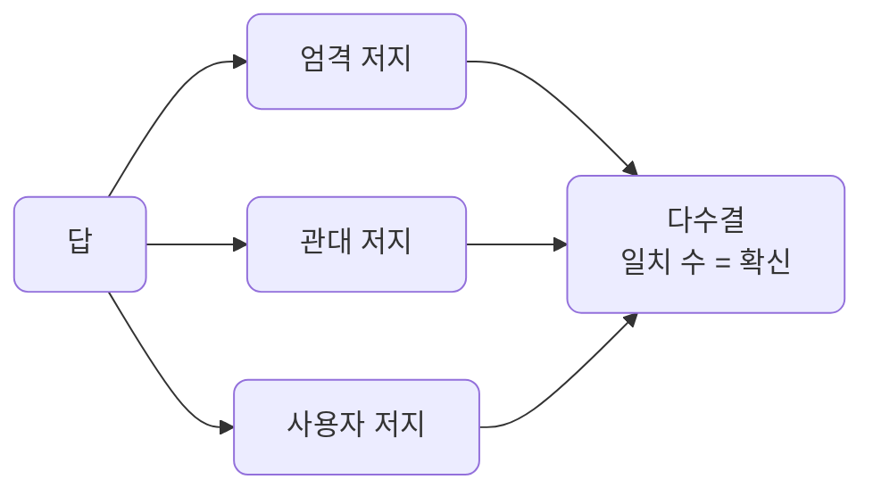
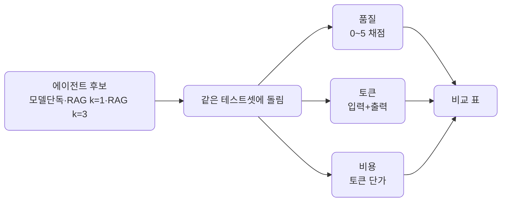
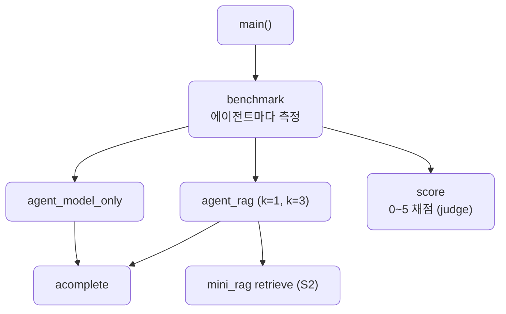

# lec06 — 평가·검증

> - S4 개요: [docs/section4/README.md](../README.md)
> - 분량 12분
> - 산출물: 평가 하네스

## 1. 목표

여러 에이전트 후보를 같은 잣대로 견주는 평가를 만듭니다. 품질을 PASS/FAIL이 아니라 점수로 재고, 토큰과 비용도 함께 재서, 한 표에 놓고 어느 후보가 나은지를 고릅니다.



## 2. "좋아진 것 같다"로는 못 고친다

프롬프트를 바꾸고 "좀 나아진 것 같은데"라고 느끼는 것으로는 개선을 못 합니다. 느낌은 케이스마다 다르고, 어제와 비교가 안 됩니다. 품질을 숫자로 재야 무엇이 나아졌는지 보입니다.

그리고 한 에이전트의 점수만으로는 부족합니다. 평가의 값어치는 비교에 있습니다. 후보 여럿을 같은 테스트셋에 돌려, 어느 쪽이 나은지를 골라야 합니다. 품질만이 아니라 비용도 함께 봐야 합니다. 품질이 같다면 싼 쪽이, 품질이 조금 낮아도 훨씬 싸다면 그쪽이 나을 수 있으니까요.

## 3. 무엇을 재나 — 품질·토큰·비용

세 가지를 잽니다.

- 품질: 답이 기준을 얼마나 충족하는지 0~5 점수로 잽니다. PASS/FAIL 둘로는 "조금 나음"을 못 담습니다. 점수라야 미세한 차이가 보입니다.
- 토큰: 한 답에 쓴 입력·출력 토큰을 셉니다. RAG가 청크를 더 붙이면 입력이 늘고, 모델이 길게 답하면 출력이 늡니다.
- 비용: 토큰에 단가를 곱합니다. 출력 토큰이 입력보다 비쌉니다. 그래서 토큰 수와 비용 순서가 다를 수 있습니다.

품질과 비용은 대개 맞바꿉니다. 검색을 늘리면 품질이 오르지만 토큰과 비용도 오릅니다. 평가는 그 맞바꿈을 숫자로 보여줘 고르게 합니다.

## 4. 누가 채점하나 — LLM-as-judge와 패널

자연어 답은 정답이 하나로 안 떨어집니다. 사람이 일일이 보긴 느리고 비싸, 모델에게 채점을 맡깁니다. lec02~05에서 검열·주입 탐지에 쓴 LLM-as-judge를, 여기서는 품질 채점에 씁니다.

저지가 하나면 그 모델의 편향이 점수에 그대로 들어갑니다. 그래서 관점이 다른 저지를 패널로 둡니다. 엄격한 저지, 관대한 저지, 사용자 관점의 저지가 각자 채점하고 다수결로 모읍니다.



[panel.py](../../../src/section4/lec06/panel.py)를 같은 질문에 세 답으로 돌린 결과입니다.

```text
질문: 환불 되나요?
기준: 환불 가능 여부를 정확히 답하고 친절한 어조로 안내한다

답: 환불 됨.
  저지: {'엄격': 'FAIL', '관대': 'FAIL', '사용자': 'FAIL'} → 0/3 다수결 FAIL
답: 7일 이내 환불 가능합니다.
  저지: {'엄격': 'FAIL', '관대': 'PASS', '사용자': 'PASS'} → 2/3 다수결 PASS
답: 네 고객님, 환불은 결제 후 7일 이내에 가능하니 편히 신청해 주세요.
  저지: {'엄격': 'PASS', '관대': 'PASS', '사용자': 'PASS'} → 3/3 다수결 PASS
```

명확한 답은 만장일치입니다. 그런데 "7일 이내 환불 가능합니다"처럼 정확하지만 무뚝뚝한 답은 갈립니다. 엄격한 저지는 어조가 빠졌다고 FAIL, 나머지는 핵심은 담았다고 PASS입니다. 일치 수가 곧 확신의 세기이고, 갈리는 답은 사람이 들여다볼 후보입니다. LLM-judge도 모델이라 완벽하지 않으니, 기준을 또렷이 쓰고 패널로 모으고 사람이 표본을 확인합니다.

## 5. 다중 에이전트 벤치마크

[benchmark.py](../../../src/section4/lec06/benchmark.py)는 세 에이전트를 같은 테스트셋으로 돌려 품질·토큰·비용을 한 표에 놓습니다. 코퍼스는 S2 RAG(RAG를 설명한 위키 문서)입니다. 후보는 검색 없는 모델 단독, RAG k=1, RAG k=3입니다.





```bash
uv run python src/section4/lec06/benchmark.py
```

| 에이전트 | 품질(0~5) | 평균 토큰 | 상대 비용 |
| --- | --- | --- | --- |
| 모델 단독 | 3.8 | 1134 | 2.5x |
| RAG k=1 | 5.0 | 1519 | 1.0x |
| RAG k=3 | 5.0 | 2574 | 1.6x |

읽어낼 점입니다.

- 품질은 점수입니다. 모델 단독 3.8, RAG 둘 다 5.0입니다. 있음/없음이 아니라 "얼마나"가 보입니다.
- 비용이 반전입니다. 모델 단독은 토큰이 제일 적은데도 비용은 제일 비쌉니다. 검색 없이 답하려니 길게 늘어놓아 출력 토큰이 많고, 출력은 입력보다 비싸기 때문입니다. RAG는 근거를 받아 짧고 정확히 답해 출력이 적습니다.
- RAG k=1이 스위트스폿입니다. 최고 품질에 최저 비용입니다. k=3은 같은 품질에 1.6배 비용입니다. 청크를 더 넣어도 이 질문들에는 품질이 안 올랐습니다.
- 표 하나로 "어느 에이전트를 쓸까"에 답이 나옵니다. 품질만 보거나 비용만 봐서는 안 보이고, 둘을 같이 놔야 보입니다.

## 6. 정리

- 느낌으로는 개선을 못 합니다. 테스트셋으로 품질을 숫자로 잽니다.
- 한 에이전트가 아니라 후보 여럿을 견줍니다. 품질만이 아니라 토큰·비용도 함께 잽니다.
- 품질은 PASS/FAIL이 아니라 0~5 점수로 재야 미세한 차이가 보입니다.
- 채점은 LLM-judge가 하되, 관점이 다른 저지를 패널로 모아 편향을 줄이고 사람이 표본을 확인합니다.
- 품질과 비용은 맞바꿉니다. 표로 트레이드오프를 보여 어느 후보를 쓸지 숫자로 답합니다.
