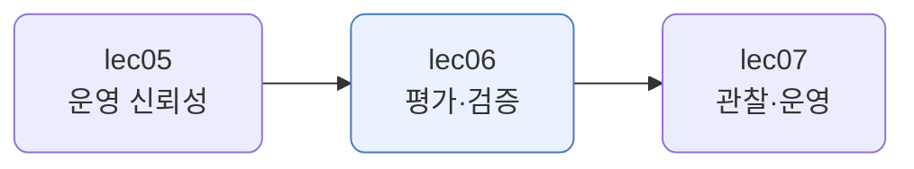
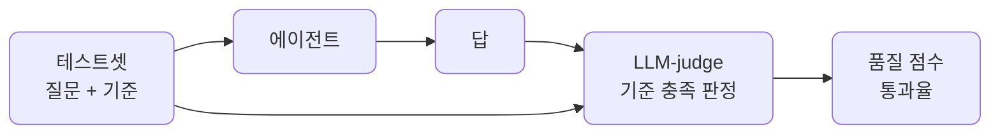
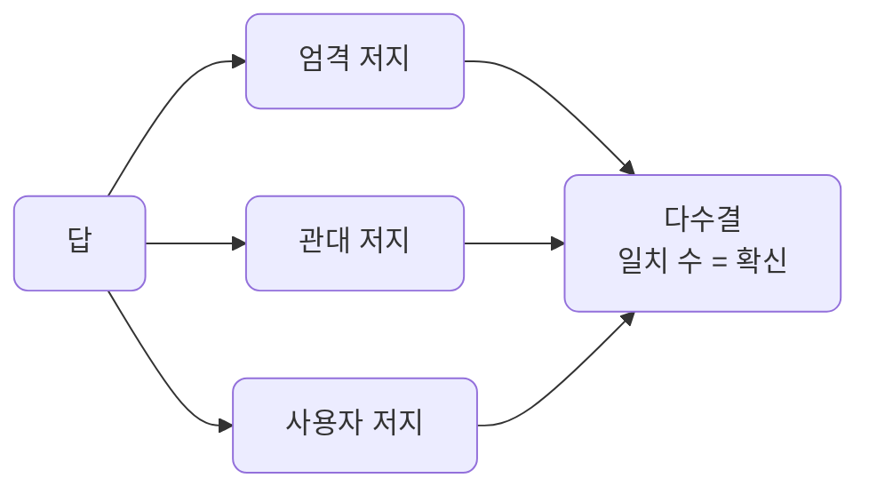
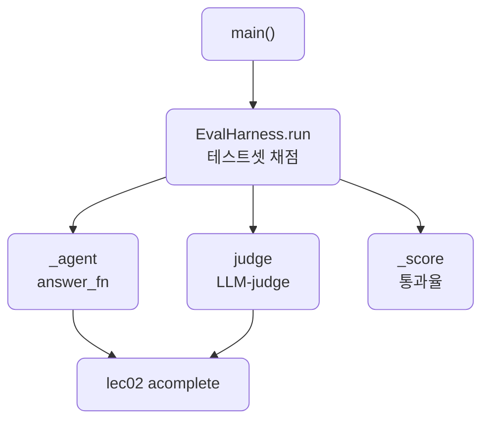

# lec06 — 평가·검증

> - S4 개요: [docs/section4/README.md](../README.md)
> - 분량 14분
> - 산출물: 평가 하네스

## 1. 목표

LLM-as-judge와 테스트셋으로 에이전트 품질을 점수화합니다. 버전 전후를 비교해 개선을 기록하고, 어떤 케이스가 실패하는지로 한계를 분석합니다.



## 2. "좋아진 것 같다"로는 못 고친다

프롬프트를 바꾸고 "좀 나아진 것 같은데"라고 느끼는 것으로는 개선을 못 합니다. 느낌은 케이스마다 다르고, 어제와 비교가 안 됩니다. 품질을 숫자로 재야 무엇이 나아졌고 무엇이 그대로인지 보입니다.

그런데 정답이 하나로 딱 떨어지지 않는 자연어 답을 어떻게 채점할까요. 사람이 일일이 보기엔 느리고 비쌉니다. 그래서 모델에게 채점을 맡깁니다. 우리가 lec02~05에서 검열·주입 탐지에 쓴 LLM-as-judge를, 이번에는 품질 채점에 씁니다.

## 3. 평가의 세 부품

평가 하네스는 세 부품으로 이뤄집니다. 테스트셋, LLM-judge, 점수입니다.



- 테스트셋: 질문과, 좋은 답이 갖춰야 할 기준의 목록입니다. 기준이 모호하면 채점도 흔들리니, "결제 후 7일 이내 환불 가능을 안내한다"처럼 또렷하게 적습니다.
- LLM-judge: 답이 기준을 충족하면 PASS, 아니면 FAIL로 판정합니다. 사람 대신 모델이 채점합니다.
- 품질 점수: 통과율로 모읍니다. 한 숫자라 버전끼리 비교됩니다.

## 4. 개선 로그와 한계 분석

점수가 한 숫자로 나오면 두 가지를 할 수 있습니다. 버전 전후를 비교해 개선을 기록하고, 실패한 케이스를 모아 한계를 봅니다.

이 단원에서는 지식이 없는 약한 에이전트와, 같은 질문에 제품 정보를 근거로 받은 개선 에이전트를 같은 테스트셋으로 평가합니다. 점수가 얼마나 오르는지가 개선 로그이고, 약한 버전이 어디서 틀렸는지가 한계 분석입니다.

약한 에이전트를 혼자 재는 것은 별 의미가 없습니다. "나쁘다"로 끝나니까요. 약한 버전은 개선 전의 대조군(baseline)이고, 평가의 값어치는 늘 비교에 있습니다. 이전 버전 대비 얼마나 나아졌는지를 봅니다. 그리고 점수는 모델만이 아니라 시스템 전체(프롬프트·지식·하네스)를 잰다는 점을 기억합니다. 무엇을 바꾸든 그 변화가 점수에 드러납니다.

LLM-judge도 모델이라 완벽하지는 않습니다. 기준을 또렷하게 쓰고, 가끔 사람이 표본을 확인해 채점이 믿을 만한지 봅니다. 채점기를 채점하는 셈입니다.

## 5. 여러 저지로 채점 — 패널

저지가 하나면 그 모델의 편향과 맹점이 그대로 점수에 들어갑니다. 그래서 관점이 다른 저지를 여럿 둡니다. 엄격한 저지, 관대한 저지, 사용자 관점의 저지가 각자 채점하고 다수결로 모읍니다.



[panel.py](../../../src/section4/lec06/panel.py)를 같은 질문에 세 답으로 돌린 결과입니다.

```text
질문: 환불 되나요?
기준: 환불 가능 여부를 정확히 답하고 친절한 어조로 안내한다

답: 환불 됨.
  저지: {'엄격': 'FAIL', '관대': 'FAIL', '사용자': 'FAIL'} → 0/3 다수결 FAIL
답: 7일 이내 환불 가능합니다.
  저지: {'엄격': 'FAIL', '관대': 'PASS', '사용자': 'PASS'} → 2/3 다수결 PASS
답: 네 고객님, 환불은 결제 후 7일 이내에 가능하니 편히 신청해 주세요.
  저지: {'엄격': 'PASS', '관대': 'PASS', '사용자': 'PASS'} → 3/3 다수결 PASS
```

명확한 답은 만장일치입니다. 너무 짧은 답은 셋 다 FAIL, 친절하고 정확한 답은 셋 다 PASS입니다. 그런데 "7일 이내 환불 가능합니다"처럼 정확하지만 무뚝뚝한 답은 갈립니다. 엄격한 저지는 어조가 빠졌다고 FAIL, 관대·사용자 저지는 핵심은 담았다고 PASS입니다. 일치 수가 곧 확신의 세기입니다. 갈리는 답은 애매하다는 신호라 사람이 들여다볼 후보입니다.

`panel_judge`는 [EvalHarness](../../../src/section4/lec06/evaluate.py)의 `judge_fn`에 그대로 꽂힙니다. 저지를 주입식으로 둔 설계라, 한 저지든 패널이든 바꿔 끼우기만 하면 됩니다.

## 6. 예제 코드가 하는 일 및 결과

[evaluate.py](../../../src/section4/lec06/evaluate.py)는 약한 에이전트와 개선 에이전트를 같은 테스트셋으로 채점해, 점수와 실패 케이스를 보입니다.



```bash
uv run python src/section4/lec06/evaluate.py
```

```text
=== 약한 에이전트 (지식 없음): 품질 0% ===
  [FAIL] 환불 되나요?
  [FAIL] 팀으로 같이 쓸 수 있나요?
  [FAIL] 데이터는 어디에 저장되나요?
=== 개선 에이전트 (지식 주입): 품질 100% ===
  [PASS] 환불 되나요?
  [PASS] 팀으로 같이 쓸 수 있나요?
  [PASS] 데이터는 어디에 저장되나요?

개선 로그: 0% → 100%
한계 분석(약한 버전 실패): ['환불 되나요?', '팀으로 같이 쓸 수 있나요?', '데이터는 어디에 저장되나요?']
```

읽어낼 점입니다.

- 품질이 한 숫자로 나옵니다. 약한 에이전트는 0%, 지식을 받은 개선 에이전트는 100%입니다. 느낌이 아니라 점수라 버전끼리 비교됩니다.
- 개선 로그가 0%에서 100%로 오른 것을 기록합니다. 무엇을 바꿔 얼마나 나아졌는지가 남습니다.
- 한계 분석은 약한 버전이 세 케이스를 다 틀렸음을 짚습니다. 지식이 없어 사실을 못 댄 것입니다. 어디를 고쳐야 할지가 보입니다.
- 채점은 LLM-judge가 합니다. lec02~05에서 검열·탐지에 쓴 같은 기법을, 여기서는 품질 채점에 씁니다.

## 7. 정리

- 느낌으로는 개선을 못 합니다. 테스트셋과 LLM-judge로 품질을 숫자로 잽니다.
- 평가 하네스는 테스트셋·LLM-judge·점수 세 부품입니다. 기준을 또렷하게 써야 채점이 흔들리지 않습니다.
- 점수가 한 숫자라 버전 전후를 비교해 개선을 기록하고, 실패 케이스로 한계를 분석합니다.
- LLM-judge도 모델이라 완벽하지 않습니다. 기준을 또렷이 하고, 관점이 다른 저지를 패널로 모으고, 사람이 표본으로 확인합니다.
- 점수는 모델만이 아니라 시스템 전체를 잽니다. 약한 버전은 개선을 견줄 대조군입니다.
