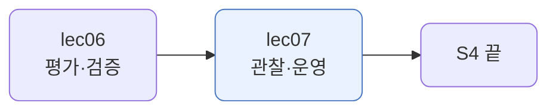
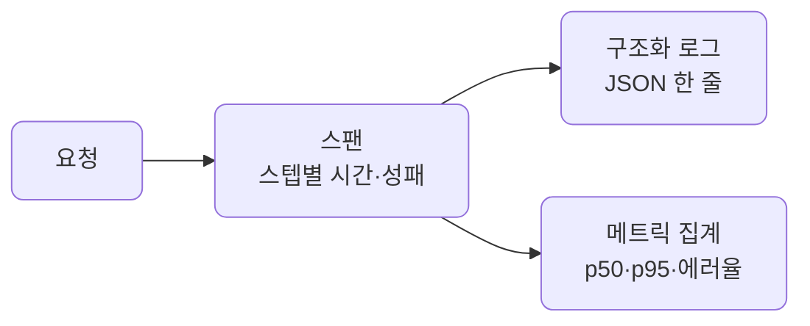
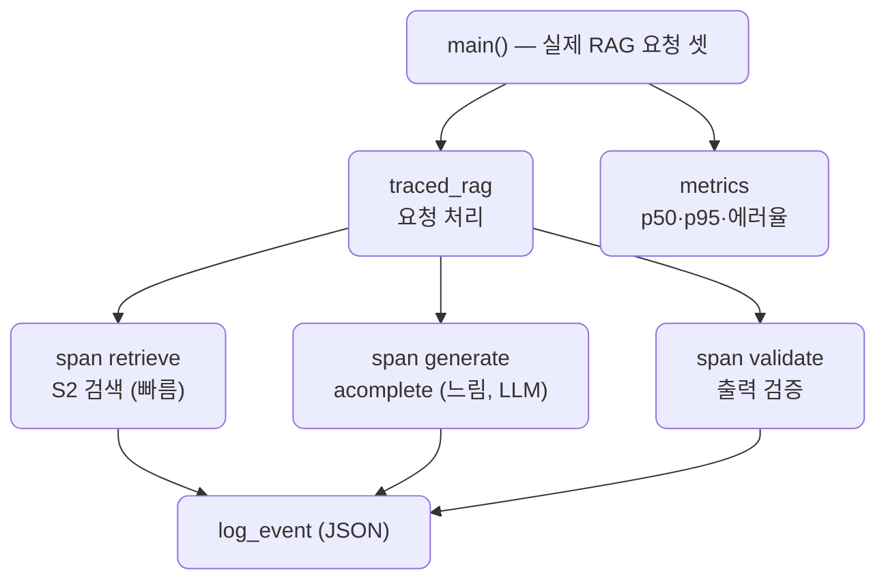

# lec07 — 관찰·운영

> - S4 개요: [docs/section4/README.md](../README.md)
> - 분량 12분
> - 산출물: 관찰 모듈

## 1. 목표

돌아가는 시스템을 들여다보는 관찰 모듈을 만듭니다. 구조화 로그로 사건을 남기고, 트레이싱으로 한 요청의 스텝별 시간을 재고, 메트릭으로 여러 요청의 추세를 봅니다.



## 2. 한 요청에서 수천 요청으로

앞 단원들의 하네스는 `self.trace`에 스텝을 남겼습니다. 한 요청을 들여다보기엔 좋았죠. 그런데 운영은 수천 요청이 동시에 도는 곳입니다. "이 요청이 뭘 했나"만으로는 부족하고, "전체에서 무엇이 느리고 얼마나 실패하나"를 봐야 합니다.

그래서 관찰을 체계로 만듭니다. 사건은 기계가 읽을 수 있게 남기고, 한 요청의 흐름은 시간과 함께 기록하고, 여러 요청은 모아서 추세로 봅니다.

## 3. 세 겹 — 구조화 로그·트레이싱·메트릭



- 구조화 로그: `print("스텝 끝남")` 대신 JSON으로 남깁니다. `{"request": "req-3", "step": "generate", "ms": 20.8, "ok": false}`처럼 필드가 있어, 기계가 grep하고 집계합니다. 평문 로그는 사람만 읽지만, 구조화 로그는 도구가 읽습니다.
- 트레이싱: 한 요청의 스텝을 스팬으로 잽니다. 스팬은 이름·소요 시간·성패입니다. `with trace.span("generate"):` 블록의 시간을 재서, 어느 스텝이 느렸는지 보입니다.
- 메트릭: 여러 요청의 스팬을 모읍니다. p50·p95 지연, 에러율 같은 것입니다. 개별 로그로는 안 보이는 전체 건강이 한 숫자로 보입니다.

개별 로그는 한 사건을, 메트릭은 전체 추세를 봅니다. 운영은 둘 다 봅니다. 무엇이 터졌는지는 로그로 파고들고, 시스템이 건강한지는 메트릭으로 살핍니다.

## 4. 예제 코드가 하는 일 및 결과

[observe.py](../../../src/section4/lec07/observe.py)는 실제 RAG 요청 셋을 관찰을 끼워 처리합니다. 가짜 sleep이 아니라 S2 RAG의 진짜 검색과 LLM 생성을 스팬으로 잽니다. 요청마다 검색·생성·검증을 재고, 구조화 로그를 찍고, 끝나면 메트릭으로 모읍니다.



```bash
uv run python src/section4/lec07/observe.py
```

```text
=== 구조화 로그 (실제 RAG 요청의 스텝을 JSON 한 줄로) ===
{"request": "req-0", "step": "retrieve", "ms": 41.8, "ok": true}
{"request": "req-0", "step": "generate", "ms": 4340.4, "ok": true}
{"request": "req-0", "step": "validate", "ms": 0.0, "ok": true}
{"request": "req-1", "step": "retrieve", "ms": 54.1, "ok": true}
{"request": "req-1", "step": "generate", "ms": 2643.3, "ok": true}
{"request": "req-1", "step": "validate", "ms": 0.0, "ok": true}
{"request": "req-2", "step": "retrieve", "ms": 69.2, "ok": true}
{"request": "req-2", "step": "generate", "ms": 1119.8, "ok": true}
{"request": "req-2", "step": "validate", "ms": 0.0, "ok": false}

=== 메트릭 (요청들을 모아서) ===
  requests: 3
  spans: 9
  p50_ms: 54.1
  p95_ms: 4340.4
  error_rate: 0.11
```

읽어낼 점입니다. 시간(ms)은 실제로 재므로 실행마다 다릅니다.

- 로그가 JSON입니다. request·step·ms·ok 필드가 있어, "generate 스텝만", "ok=false만"처럼 기계가 골라냅니다. `print`로는 못 하는 일입니다.
- 스텝마다 실제 시간이 다릅니다. 검색은 50ms 안팎으로 빠르고, 생성은 LLM 호출이라 1~4초로 느립니다. 어느 스텝이 병목인지 한눈에 보입니다.
- p50는 54ms, p95는 4340ms로 크게 벌어집니다. 중앙값은 빠른 검색 스팬이고 95분위는 가장 느린 생성 스팬이기 때문입니다. LLM 호출이 지연을 지배한다는 게 메트릭으로 드러납니다.
- req-2의 validate가 `ok: false`입니다. 출력 검증 실패가 스팬에 남고 에러율 0.11로 집계됩니다. 실패해도 요청은 죽지 않습니다. lec03·05에서 본 "기록하고 이어간다"와 같은 결입니다.
- `self.trace`(앞 단원들)가 한 요청의 관찰이었다면, 여기서는 실제 RAG 요청들의 운영을 봅니다. 같은 트레이스 개념을 구조화 로그와 메트릭으로 키운 것입니다.

실전에서는 OpenTelemetry로 트레이싱하고, 구조화 로깅 라이브러리로 로그를 남기고, Grafana·Datadog 같은 도구로 메트릭을 모니터링합니다. LiteLLM도 콜백으로 관찰 도구에 붙습니다. 직접 짜 보면 그 도구들이 무엇을 하는지 또렷해집니다.

## 5. 정리

- 한 요청을 보는 `self.trace`로는 운영이 부족합니다. 수천 요청의 추세를 봐야 합니다.
- 구조화 로그는 사건을 JSON으로 남겨 기계가 읽게 합니다. 평문 로그와 다릅니다.
- 트레이싱은 한 요청의 스텝을 시간·성패와 함께 스팬으로 기록합니다.
- 메트릭은 여러 요청을 모아 p50·p95 지연, 에러율 같은 추세를 봅니다.
- 로그로 파고들고 메트릭으로 살핍니다. 실전에서는 OpenTelemetry·Grafana 같은 도구가 이 역할을 합니다.
