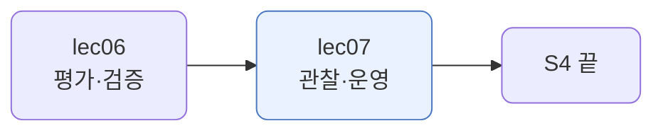
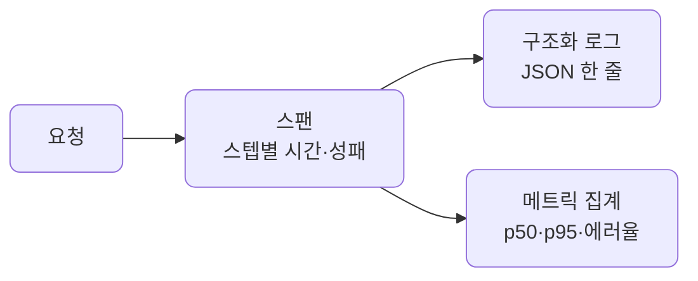
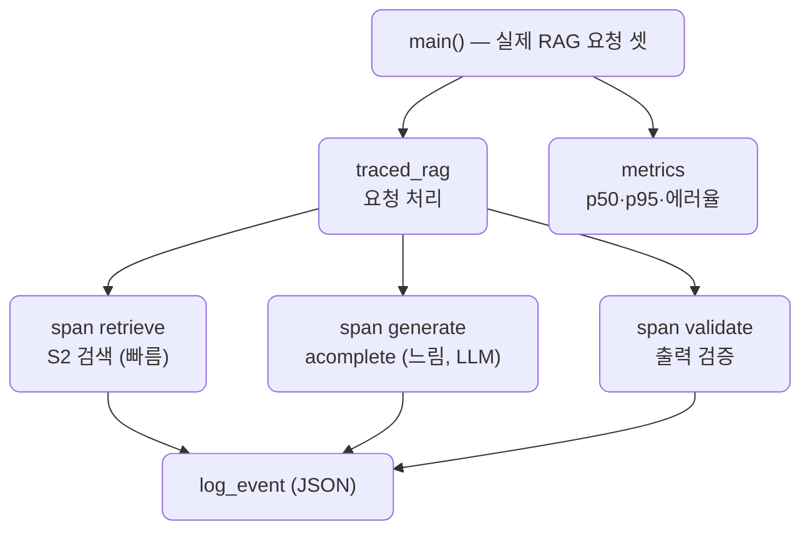
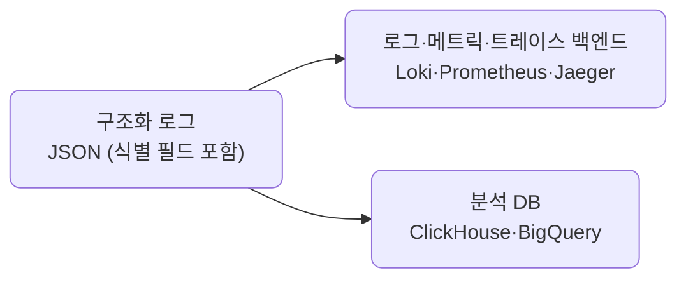
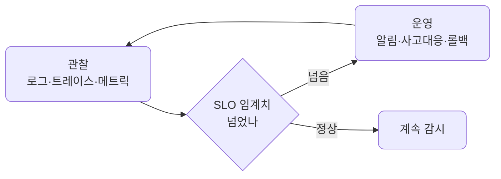

# lec07 — 관찰·운영

> - S4 개요: [docs/section4/README.md](../README.md)
> - 분량 12분
> - 산출물: 관찰 모듈

## 1. 목표

돌아가는 시스템을 들여다보는 관찰 모듈을 만듭니다. 구조화 로그로 사건을 남기고, 트레이싱으로 한 요청의 스텝별 시간을 재고, 메트릭으로 여러 요청의 추세를 봅니다.



## 2. 한 요청에서 수천 요청으로

앞 단원들의 하네스는 `self.trace`에 스텝을 남겼습니다. 한 요청을 들여다보기엔 좋았죠. 그런데 운영은 수천 요청이 동시에 도는 곳입니다. "이 요청이 뭘 했나"만으로는 부족하고, "전체에서 무엇이 느리고 얼마나 실패하나"를 봐야 합니다.

그래서 관찰을 체계로 만듭니다. 사건은 기계가 읽을 수 있게 남기고, 한 요청의 흐름은 시간과 함께 기록하고, 여러 요청은 모아서 추세로 봅니다.

## 3. 세 겹 — 구조화 로그·트레이싱·메트릭



- 구조화 로그: `print("스텝 끝남")` 대신 JSON으로 남깁니다. `{"request": "req-3", "step": "generate", "ms": 20.8, "ok": false}`처럼 필드가 있어, 기계가 grep하고 집계합니다. 평문 로그는 사람만 읽지만, 구조화 로그는 도구가 읽습니다.
- 트레이싱: 한 요청의 스텝을 스팬으로 잽니다. 스팬은 이름·소요 시간·성패입니다. `with trace.span("generate"):` 블록의 시간을 재서, 어느 스텝이 느렸는지 보입니다.
- 메트릭: 여러 요청의 스팬을 모읍니다. p50·p95 지연, 에러율 같은 것입니다. 개별 로그로는 안 보이는 전체 건강이 한 숫자로 보입니다.

개별 로그는 한 사건을, 메트릭은 전체 추세를 봅니다. 운영은 둘 다 봅니다. 무엇이 터졌는지는 로그로 파고들고, 시스템이 건강한지는 메트릭으로 살핍니다.

## 4. 예제 코드가 하는 일 및 결과

[observe.py](../../../src/section4/lec07/observe.py)는 실제 RAG 요청 셋을 관찰을 끼워 처리합니다. 가짜 sleep이 아니라 S2 RAG의 진짜 검색과 LLM 생성을 스팬으로 잽니다. 요청마다 검색·생성·검증을 재고, 누구의 어떤 요청인지(user·session·request)와 함께 구조화 로그를 찍고, 끝나면 전체 메트릭과 사용자별 메트릭으로 모읍니다.



```bash
uv run python src/section4/lec07/observe.py
```

```text
=== 구조화 로그 (누구의 어떤 요청인지까지 JSON 한 줄로) ===
{"user": "alice", "session": "sess-a", "request": "req-0", "step": "retrieve", "ms": 68.1, "ok": true}
{"user": "alice", "session": "sess-a", "request": "req-0", "step": "generate", "ms": 4292.5, "ok": true}
{"user": "alice", "session": "sess-a", "request": "req-0", "step": "validate", "ms": 0.0, "ok": true}
...
{"user": "bob", "session": "sess-b", "request": "req-2", "step": "generate", "ms": 1126.3, "ok": true}
{"user": "bob", "session": "sess-b", "request": "req-2", "step": "validate", "ms": 0.0, "ok": false}

=== 메트릭 (전체) ===
  requests: 3
  spans: 9
  p50_ms: 68.1
  p95_ms: 4292.5
  error_rate: 0.11

=== 사용자별 메트릭 ===
  alice: 요청 2, p95 4292.5ms, 에러율 0.0
  bob: 요청 1, p95 1126.3ms, 에러율 0.33
```

읽어낼 점입니다. 시간(ms)은 실제로 재므로 실행마다 다릅니다.

- 로그가 JSON입니다. user·request·step·ms·ok 필드가 있어, "generate 스텝만", "bob의 요청만", "ok=false만"처럼 기계가 골라냅니다. `print`로는 못 하는 일입니다.
- 스텝마다 실제 시간이 다릅니다. 검색은 50~70ms로 빠르고, 생성은 LLM 호출이라 1~4초로 느립니다. p50는 검색 스팬, p95는 가장 느린 생성 스팬이라, LLM 호출이 지연을 지배한다는 게 메트릭으로 드러납니다.
- 사용자별로 갈라 보면 더 보입니다. alice는 에러율 0.0인데 bob은 0.33입니다. 전체 에러율 0.11에 묻혀 있던 "어느 사용자가 문제인가"가 드러납니다. 검증 실패도 스팬에 남고 요청은 죽지 않습니다. lec03·05에서 본 "기록하고 이어간다"와 같은 결입니다.
- `self.trace`(앞 단원들)가 한 요청의 관찰이었다면, 여기서는 실제 RAG 요청들의 운영을 봅니다. 같은 트레이스 개념을 식별 필드·구조화 로그·메트릭으로 키운 것입니다.

실전에서는 OpenTelemetry로 트레이싱하고, 구조화 로깅 라이브러리로 로그를 남기고, Grafana·Datadog 같은 도구로 메트릭을 모니터링합니다. LiteLLM도 콜백으로 관찰 도구에 붙습니다. 직접 짜 보면 그 도구들이 무엇을 하는지 또렷해집니다.

## 5. 누구의 요청인가, 어디에 남기나

로그에 user·session·request를 남겼더니 사용자별 메트릭이 공짜로 나왔습니다. bob의 에러율이 alice보다 높다는 것을 전체 숫자에 묻히지 않고 짚어냅니다. 누가 비용을 많이 쓰는지(lec05 사용자별 예산), 어느 테넌트가 느린지, 이 사용자의 그 요청을 따라가며 디버그하기 — 다 식별 필드 덕입니다. 구조화 로그라 필드 하나 더 다는 게 전부입니다. 실전에서는 trace_id(서비스 간 상관)·model·tokens·cost도 함께 답니다.

그럼 이 로그를 어디에 둘까요. 평문 파일로 쌓아두진 않습니다. 구조화돼 있어서 용도에 맞는 곳으로 흘려보냅니다.



- 운영(디버그·알림·대시보드)은 로그·메트릭·트레이스 백엔드로 보냅니다. Loki·Prometheus·Jaeger, 또는 Datadog 같은 것입니다.
- 오래 질의할 것(사용자별 비용, 몇 달 추세, 감사)은 분석 DB에 적재합니다. ClickHouse·BigQuery·Postgres 같은 것입니다.

구조화 로그가 둘을 잇는 다리입니다. 평문이면 사람만 읽지만, JSON이면 백엔드도 DB도 읽습니다. 그래서 "로그냐 DB냐"가 아니라, 같은 구조화 로그를 용도에 맞는 곳으로 보내는 것입니다.

## 6. 운영 — 메트릭을 행동으로

관찰이 보는 것이라면, 운영은 본 것으로 행동하는 것입니다. 사람이 메트릭을 종일 들여다볼 수는 없습니다. 그래서 임계치(SLO)를 두고, 넘으면 알림이 깨웁니다. 알림이 관찰과 운영을 잇는 다리입니다.



```python
def check_alerts(m, p95_max=3000, error_max=0.05):
    alerts = []
    if m["p95_ms"] > p95_max:
        alerts.append(f"p95 지연 {m['p95_ms']}ms > {p95_max}ms")
    if m["error_rate"] > error_max:
        alerts.append(f"에러율 {m['error_rate']} > {error_max}")
    return alerts
```

[observe.py](../../../src/section4/lec07/observe.py)는 메트릭에 이 알림을 걸어 둡니다. 위 실행의 메트릭에 SLO를 대면 이렇게 됩니다.

```text
=== 운영: SLO 알림 (임계치 p95<3000ms, 에러율<0.05) ===
  [ALERT] 전체: p95 지연 4292.5ms > 3000.0ms
  [ALERT] alice: p95 지연 4292.5ms > 3000.0ms
  [ALERT] bob: 에러율 0.33 > 0.05
```

전체와 alice는 p95가 SLO를 넘어 지연 경보가, bob은 에러율이 넘어 에러 경보가 뜹니다. 정상이면 아무것도 안 뜹니다. 이게 운영의 시작입니다. 메트릭이 SLO를 벗어나면 사람을 깨워 손을 쓰게 합니다.

알림은 운영의 한 조각일 뿐입니다. 운영에는 대시보드(메트릭을 계속 봄), SLO·SLA(목표를 정하고 추적), 사고 대응(터지면 로그·트레이스로 파고들어 고치고 회고), 안전한 배포(Canary로 조금 내보내고 메트릭 보다가 나빠지면 롤백), 온콜·런북이 다 들어갑니다. 대부분은 코드가 아니라 도구·프로세스입니다. Prometheus 알림 룰, PagerDuty, Grafana, CI/CD Canary 같은 것입니다. 관찰이 그 모두의 토대입니다.

## 7. 정리

- 한 요청을 보는 `self.trace`로는 운영이 부족합니다. 수천 요청의 추세를 봐야 합니다.
- 구조화 로그는 사건을 JSON으로 남겨 기계가 읽게 합니다. 평문 로그와 다릅니다.
- 트레이싱은 한 요청의 스텝을 시간·성패와 함께 스팬으로 기록합니다.
- 메트릭은 여러 요청을 모아 p50·p95 지연, 에러율 같은 추세를 봅니다.
- 로그로 파고들고 메트릭으로 살핍니다. 실전에서는 OpenTelemetry·Grafana 같은 도구가 이 역할을 합니다.
- user·session·request 같은 식별 필드를 남기면 사용자별 메트릭이 나옵니다. 구조화 로그라 백엔드(Loki·Prometheus)와 분석 DB(ClickHouse) 양쪽으로 보낼 수 있습니다.
- 관찰은 보는 것, 운영은 행동하는 것입니다. SLO 임계치를 넘으면 알림이 깨우고, 거기서 사고 대응·롤백 같은 운영이 시작됩니다.
