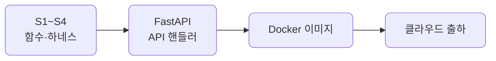
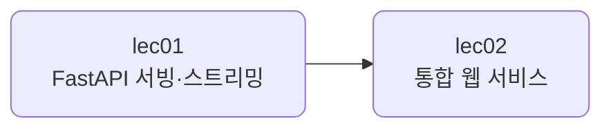

# S5 — 서빙 & 배포

> 상위 계획: [docs/plan/vod_plan.md](../plan/vod_plan.md)의 S5 항목

S1~S4에서 만든 것을 바깥으로 내보내는 레이어입니다. 지금까지는 스크립트를 직접 실행해 결과를 봤습니다. 이번에는 그 기능을 API로 감싸 다른 프로그램이 부를 수 있게 하고, 컨테이너로 묶어 클라우드에 출하합니다.

맛보기 수준입니다. 본격 서빙(스케일링·큐·GPU 추론 등)은 트랙·모듈에서 심화합니다. 여기서는 "만든 것을 어떻게 API로 내보내고 배포하는가"의 한 줄기만 잡습니다.

## 학습 방식

S1~S4와 같습니다. 예제 코드는 이 저장소로 공유되며, devcontainer 안에서 실행해 결과를 관찰하고 핵심을 읽어 이해합니다. 손으로 바꿔보는 부분은 각 단위의 "직접 해보기"로 한정합니다.

## 관통하는 원칙

만든 것을 그대로 감싸 내보냅니다. 새로 짜는 게 아니라, S1~S4의 함수·하네스를 API 핸들러가 호출하게 두는 것입니다. 그래서 서빙 코드는 얇습니다.

개발과 운영은 다릅니다. devcontainer는 개발용이고, 배포 이미지는 운영용입니다. 무엇이 다른지(의존성·환경변수·키 출처)를 짚고, 같은 코드를 두 환경에서 돌게 합니다.

## 단위 구성

| 단위 | 분 | 주제 | 산출물 |
| --- | --- | --- | --- |
| [lec01](lec01/README.md) | 25 | FastAPI 서빙 + 스트리밍 | 추론 API 서버 |
| [lec02](lec02/README.md) | 37 | 통합 웹 서비스 (채팅 + 관리자) | 통합 데모 레포 |

합계 62분, 2단위입니다. lec02는 end-to-end 통합 데모를 겸해, 별도 캡스톤을 두지 않습니다.

## 흐름

먼저 기능을 API로 감쌉니다. lifespan으로 자원을 띄우고, 엔드포인트로 요청을 받고, 입력을 검증하고, 응답을 스트리밍으로 흘려보냅니다. 그다음 지금까지 만든 것을 한 어시스턴트로 엮어 채팅·관리자 웹 페이지를 내고, Docker 이미지로 묶어 클라우드에 출하합니다.

## 코드와 테스트

공유되는 예제 코드는 [src/section5](../../src/section5)에, 테스트는 [tests/section5](../../tests/section5)에 같은 `lecNN` 구조로 들어 있습니다. 이 저장소를 받아 devcontainer 안에서 그대로 실행하는 것이 기본이고, 손으로 바꿔보는 부분은 각 단위의 "직접 해보기"로 한정합니다.
