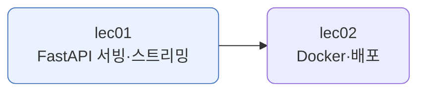
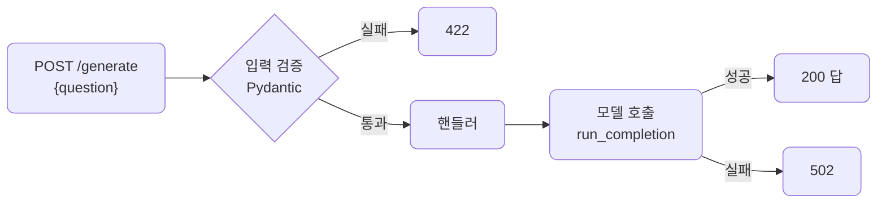
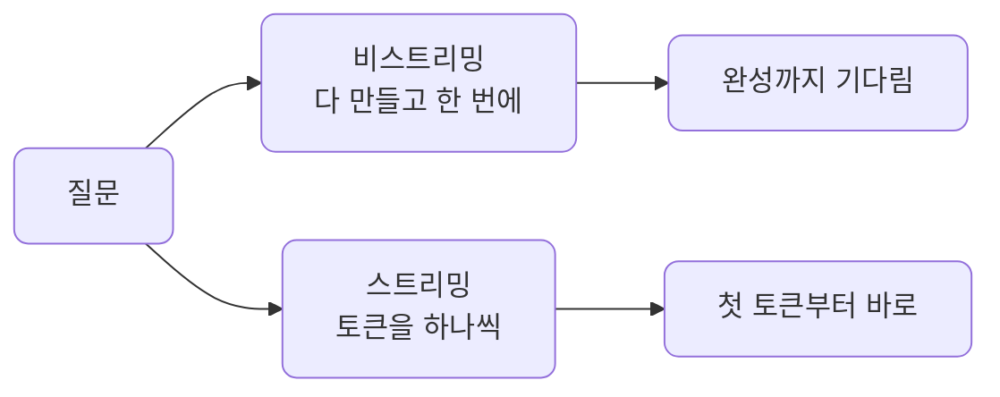
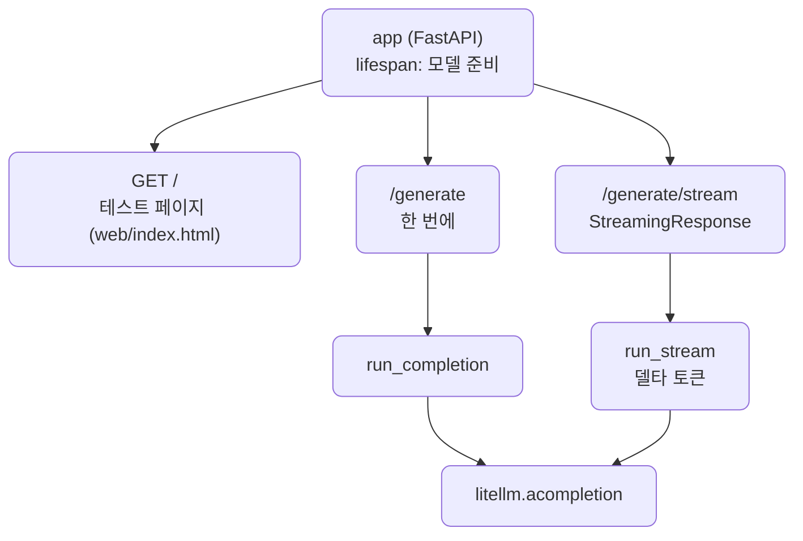

# lec01 — FastAPI 서빙 + 스트리밍

> - S5 개요: [docs/section5/README.md](../README.md)
> - 분량 10분
> - 산출물: 추론 API 서버

## 1. 목표

S1~S4에서 만든 기능을 FastAPI로 감싸 API 서버로 내보냅니다. 서버가 뜰 때 자원을 준비하고(lifespan으로), 요청 입력을 검증하고, 에러를 또렷이 처리하고, 답을 토큰 단위로 흘려보내는 스트리밍까지 합니다.



## 2. 만든 것을 그대로 감싼다

서빙은 새 기능을 짜는 일이 아닙니다. 이미 만든 함수를 핸들러가 부르게 두는 일입니다. 그래서 서빙 코드는 얇습니다.

여기서는 모델 호출(LiteLLM)을 감쌉니다. 핸들러는 요청에서 질문을 꺼내 모델을 부르고 답을 돌려줄 뿐입니다. S2의 RAG든 S4의 하네스든, 감싸는 모양은 똑같습니다. 핸들러가 그 함수를 부르게 두면 됩니다.

## 3. 네 조각 — lifespan·입력 검증·에러 처리·스트리밍

요청 하나가 들어와 나가는 길에 네 조각이 놓입니다.



- lifespan: 서버 수명입니다. 뜰 때 모델을 한 번 정해 `app.state`에 두고, 내릴 때 연결 풀 같은 자원을 정리합니다. 요청마다 다시 정하지 않습니다. 한 번 준비해 두고 씁니다.
- 입력 검증: `GenerateRequest`(Pydantic)가 요청을 검사합니다. 질문이 비었거나 너무 길면 핸들러에 닿기 전에 422로 막힙니다. 잘못된 입력이 모델까지 가지 않습니다.
- 에러 처리: 모델 호출이 실패하면 그대로 500으로 터지게 두지 않습니다. 502로 감싸 "모델 호출 실패"를 또렷이 알립니다.
- 스트리밍: 답을 다 만들어 한 번에 주지 않고, 토큰을 하나씩 흘려보냅니다. 다음 절에서 봅니다.

## 4. 스트리밍 — 토큰을 흘려보낸다

LLM은 답을 토큰 단위로 만듭니다. 비스트리밍은 그게 다 끝날 때까지 기다렸다 한 번에 줍니다. 답이 길면 사용자는 그동안 빈 화면을 봅니다. 스트리밍은 만들어지는 대로 토큰을 흘려보내, 첫 글자가 바로 뜹니다. 같은 답이라도 체감이 다릅니다.



FastAPI는 `StreamingResponse`로 이걸 합니다. 토큰을 하나씩 `yield`하는 async 제너레이터를 넘기면, 서버가 그대로 클라이언트에 흘려보냅니다. LiteLLM의 `stream=True`가 델타 토큰을 주고, 핸들러는 그걸 받아 `yield`만 하면 됩니다.

## 5. 예제 코드가 하는 일 및 결과

[server.py](../../../src/section5/lec01/server.py)는 위 네 조각을 갖춘 추론 API입니다. `/generate`는 답을 한 번에, `/generate/stream`은 토큰 단위로 돌려줍니다.



`main`은 `TestClient`로 서버를 띄우지 않고도 엔드포인트를 두드려 봅니다. 진짜로 띄우려면 `uvicorn`을 씁니다. 그러면 브라우저에서 `/`가 [테스트 페이지](../../../src/section5/lec01/web/index.html)를 띄웁니다. 질문을 입력해 "한 번에"와 "스트리밍" 버튼으로 두 엔드포인트를 눌러볼 수 있고, 스트리밍은 토큰이 쌓이는 것이 그대로 보입니다. POST 엔드포인트라 주소창으로는 못 부르니, 이 페이지나 `/docs`(Swagger UI)에서 호출합니다.

```bash
uv run python src/section5/lec01/server.py          # TestClient로 두드려 보기
uv run uvicorn section5.lec01.server:app --reload    # 진짜 서버로 띄우기
```

```text
=== /generate (한 번에) ===
  200 {'answer': '대한민국의 수도는 **서울**입니다.'}

=== /generate/stream (토큰을 흘려보냄) ===  하나, 둘, 셋, 넷, 다섯.

=== 입력 검증 (빈 질문은 422로 막힘) ===
  422 (검증 실패, 핸들러에 닿지 않음)
```

읽어낼 점입니다.

- `/generate`는 답을 한 번에 줍니다. 200과 함께 JSON으로 답이 옵니다.
- `/generate/stream`은 같은 일을 토큰 단위로 합니다. "하나, 둘, 셋..."이 만들어지는 대로 흘러나옵니다. 출력에서는 한 줄로 보이지만, 실제로는 조각이 차례로 도착합니다.
- 빈 질문은 422로 막힙니다. Pydantic이 핸들러 앞에서 걸러, 잘못된 입력이 모델까지 가지 않습니다.
- 모델 호출이 실패하면 502가 됩니다. 테스트는 모델을 가짜로 갈아끼워, 실제 LLM 없이도 이 네 가지를 결정적으로 확인합니다.

## 6. 정리

- 서빙은 만든 것을 감싸는 얇은 층입니다. 핸들러가 S1~S4의 함수를 부르게 둡니다.
- lifespan으로 자원을 한 번 준비하고, 내릴 때 정리합니다. 요청마다 다시 만들지 않습니다.
- Pydantic이 입력을 검증해, 잘못된 요청을 핸들러 앞에서 422로 막습니다.
- 모델 실패는 502로 또렷이 감쌉니다. 그대로 터지게 두지 않습니다.
- StreamingResponse로 토큰을 흘려보내, 긴 답도 첫 글자가 바로 뜨게 합니다.
